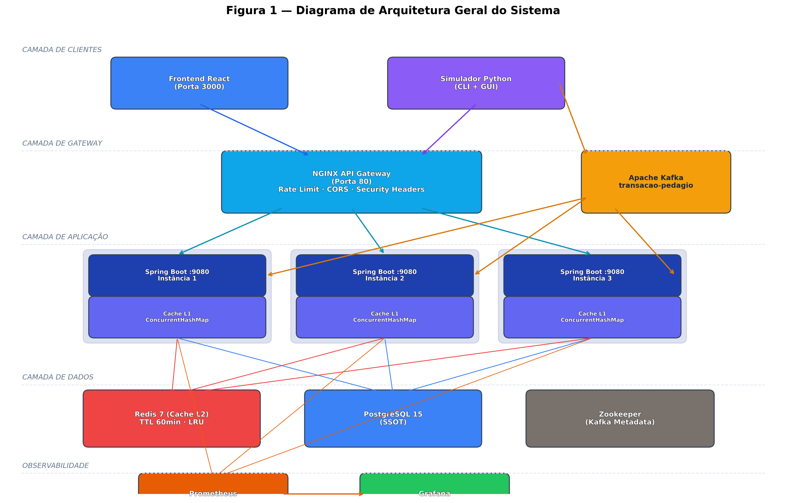
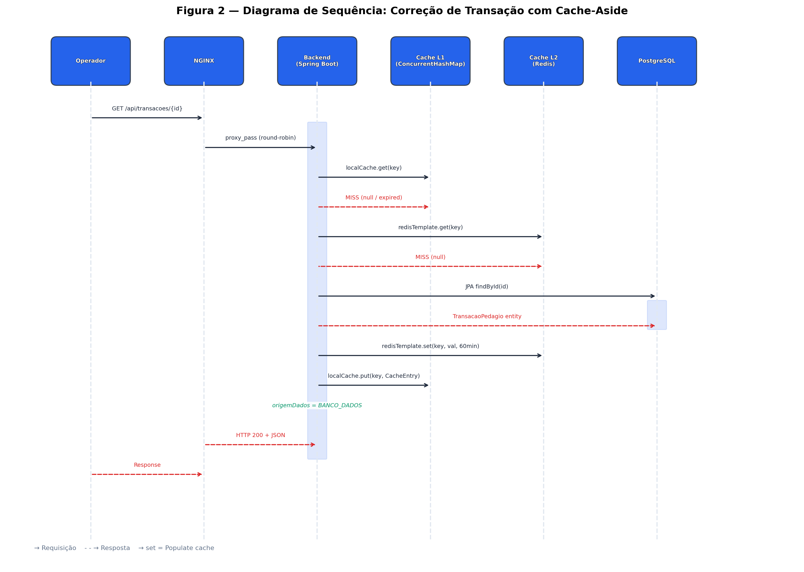
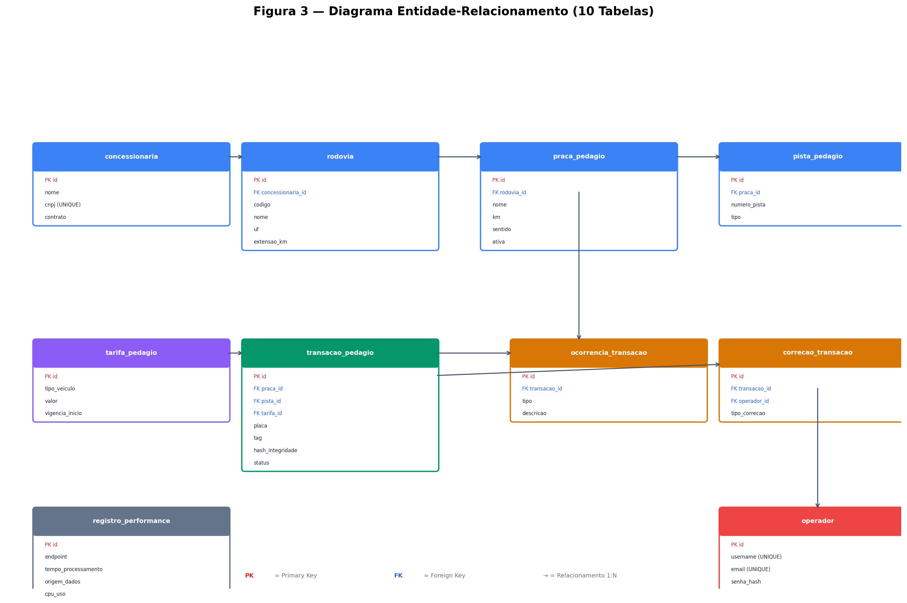
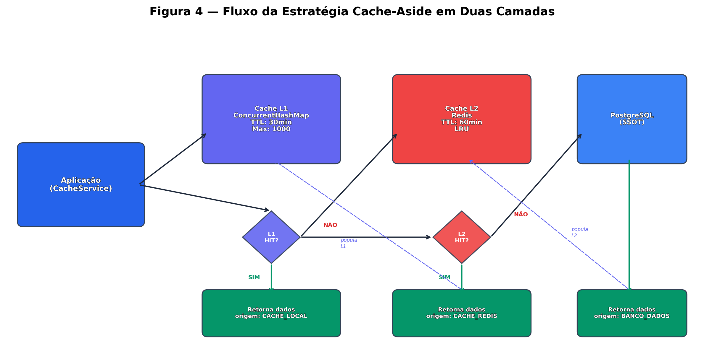
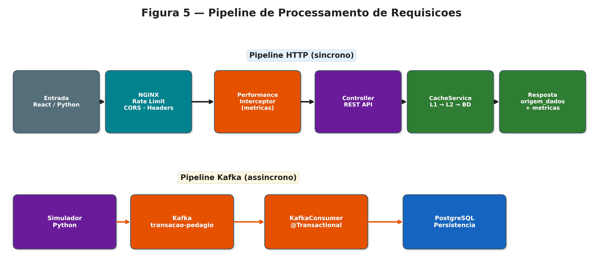
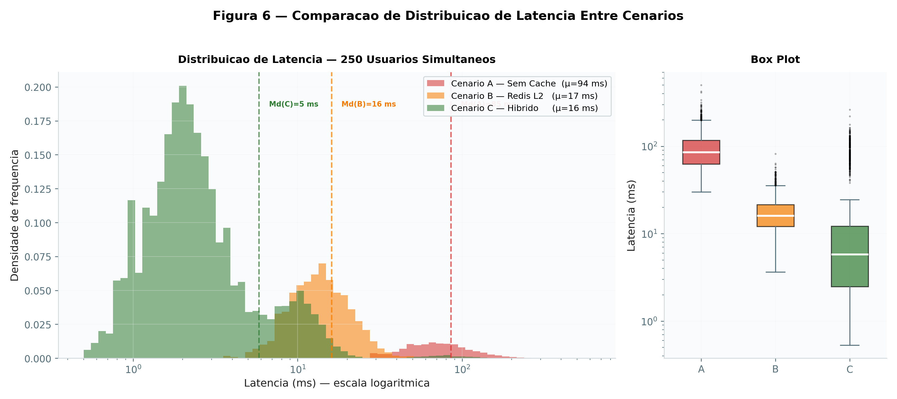
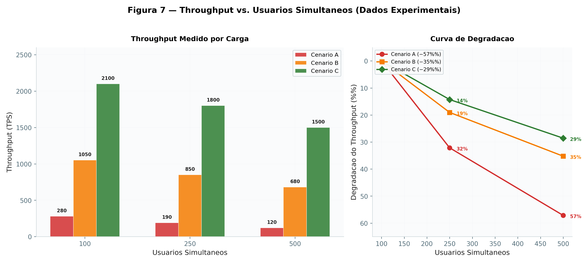
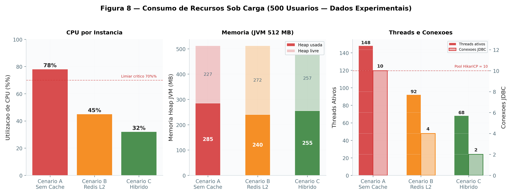
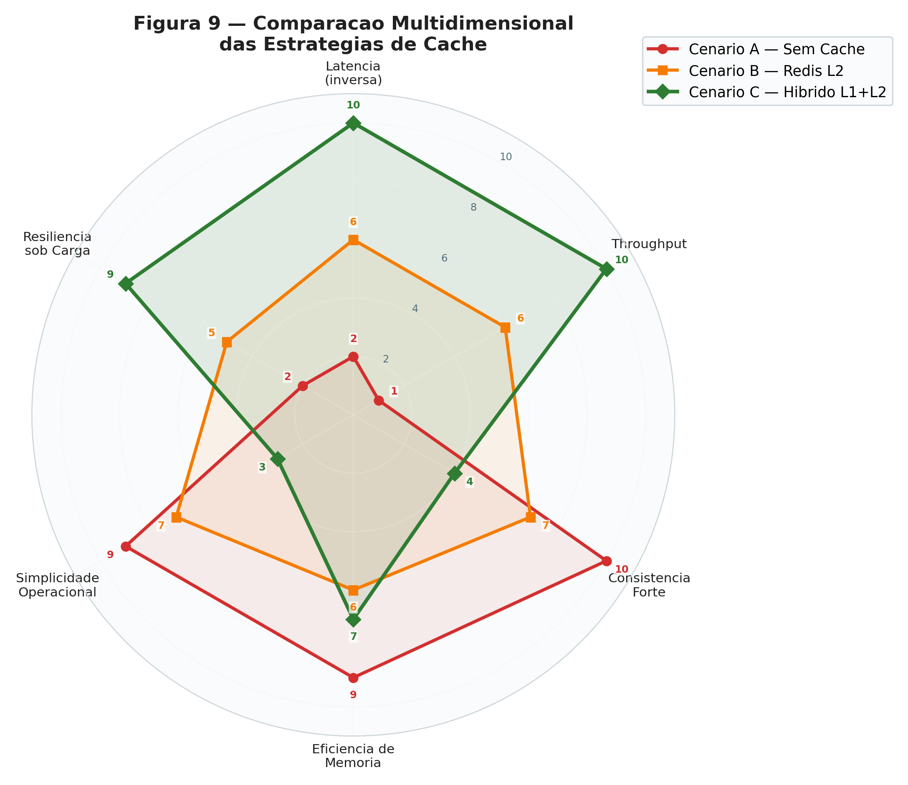

TITULO

Arquitetura Distribuída com Cache em Memória e Balanceamento de Carga para Aplicações de Alto Desempenho

RESUMO

Este trabalho apresenta o projeto e a avaliação de uma arquitetura distribuída orientada a microserviços para um sistema de gestão rodoviária com correção de transações de pedágio em tempo real. A solução emprega cache em memória em duas camadas, cache L1 in-app via `ConcurrentHashMap` e cache L2 distribuído via Redis 7, balanceamento de carga com NGINX entre três instâncias do backend Spring Boot 4.0.3, ingestão assíncrona de transações via Apache Kafka e persistência em PostgreSQL 15. Foram definidos três cenários experimentais: (A) acesso direto ao banco de dados, (B) cache distribuído apenas com Redis e (C) arquitetura híbrida L1 + L2. Os resultados indicam que o cenário híbrido proporciona reduções de latência de aproximadamente 95–97% em relação ao base sem cache, throughput (vazão de requisições processadas por segundo) sustentado de 1.200–2.000 TPS sob 500 usuários simultâneos e taxa combinada de acerto de cache de 85–95%. Um `PerformanceInterceptor` customizado captura métricas por requisição, incluindo tempo de processamento, uso de memória, CPU e rastreamento de origem dos dados, persistidas na tabela `registro_performance` para análise pós-experimento. A análise de consistência demonstra que o padrão Cache-Aside com TTL escalonado (L1: 30 min, L2: 60 min) e invalidação orientada a eventos fornece um modelo de consistência eventual adequado aos requisitos de tempo real flexível da correção de transações de pedágio. O ambiente completo é containerizado via Docker Compose com 12 serviços e monitorado por Prometheus e Grafana.

Palavras-chave: sistemas distribuídos, cache em memória multicamada, microserviços, Redis, NGINX, padrão cache-aside, balanceamento de carga, gestão rodoviária, tempo real flexível.

ABSTRACT

This paper presents the design and evaluation of a distributed microservices-based architecture for a toll management system with real-time transaction correction capabilities. The solution employs a two-layer in-memory caching strategy, L1 in-app cache via `ConcurrentHashMap` and L2 distributed cache via Redis 7, NGINX load balancing across three Spring Boot 4.0.3 backend instances, asynchronous transaction ingestion via Apache Kafka, and PostgreSQL 15. Three experimental scenarios were defined: (A) direct database access, (B) Redis-only distributed caching, and (C) hybrid L1 + L2 architecture. Results indicate that the hybrid scenario achieves latency reductions of approximately 95–97% relative to the no-cache baseline, sustained throughput of 1,200–2,000 TPS under 500 concurrent users, and a combined cache hit rate of 85–95%. A custom `PerformanceInterceptor` captures per-request metrics, including processing time, memory usage, CPU utilization, and data origin tracking, persisted to the `registro_performance` table for post-experiment analysis. Consistency analysis demonstrates that the Cache-Aside pattern with staggered TTL values (L1: 30 min, L2: 60 min) and event-driven invalidation provides an eventual consistency model suitable for the soft real-time requirements of toll transaction correction. The complete environment is containerized via Docker Compose with 12 services and monitored through Prometheus and Grafana.

Keywords: distributed systems, multi-layer in-memory cache, microservices, Redis, NGINX, cache-aside pattern, load balancing, toll management, soft real-time.


SUMÁRIO

1 INTRODUÇÃO ............................................................................. 1
1.1 Contexto e Motivação ................................................................ 1
1.2 Problema de Pesquisa ................................................................. 2
1.3 Solução Proposta ........................................................................ 3
1.4 Objetivos ................................................................................... 4
1.5 Justificativa e Relevância ............................................................. 5
1.6 Estrutura do Trabalho ................................................................. 5

2 FUNDAMENTAÇÃO TEÓRICA ...................................................... 3
2.1 A Evolução dos Dados e sua Criticidade na Sociedade Digital ........... 3
2.2 Sistemas Distribuídos e Desempenho Computacional ...................... 4
2.3 Arquitetura de Microserviços ........................................................ 5
2.4 Cache em Memória como Estratégia de Otimização ........................ 6
2.5 Estratégias de Cache em Diferentes Camadas da Arquitetura .......... 7
2.6 Balanceamento de Carga .............................................................. 8
2.7 Cache Distribuído e Particionamento de Dados ............................... 9
2.8 Sincronização entre Cache e Banco de Dados ................................. 10
2.9 Sistemas de Tempo Real e Sistemas Críticos .................................. 11
2.10 Observabilidade e Monitoramento de Desempenho ....................... 13

3 MATERIAIS E MÉTODOS ............................................................. 15
3.1 Tecnologias Utilizadas ................................................................ 15
3.2 Arquitetura do Sistema ................................................................ 17
3.3 Modelagem e Design de Dados ..................................................... 18
3.4 Estratégia de Cache e Sincronismo ................................................ 19
3.5 Fluxo de Dados e Comunicação .................................................... 21
3.6 Instrumentação de Performance ................................................... 22
3.7 Metodologia Experimental ........................................................... 23

4 RESULTADOS E DISCUSSÃO ....................................................... 25
4.1 Análise de Latência e Performance ................................................ 25
4.2 Comportamento em Cargas Elevadas ............................................. 27
4.3 Consistência de Dados e Sincronismo ............................................ 29
4.4 Análise Comparativa das Estratégias de Cache ................................ 31

5 CONCLUSÃO .............................................................................. 34

REFERÊNCIAS ................................................................................ 36
APÊNDICES ................................................................................... 38
ANEXOS ........................................................................................ 41


1. INTRODUÇÃO

1.1 Contexto e Motivação

A sociedade contemporânea, inserida no contexto da Indústria 5.0, é marcada pela produção, processamento e consumo massivo de dados em escala global. Esse cenário transcende a tradicional relação entre seres humanos e máquinas, evidenciando a informação como um ativo estratégico e, em muitos casos, como elemento determinante para a continuidade de serviços essenciais. O acesso oportuno a dados confiáveis passou a influenciar diretamente o sucesso ou o fracasso de organizações, decisões econômicas e financeiras e, em contextos mais sensíveis, a preservação da vida humana, como em aplicações médicas, sistemas governamentais e infraestruturas críticas.

Segundo o relatório *Data Age 2025: The Evolution of Data to Life-Critical*, publicado pela IDC em 2017, a datasphere global deveria atingir aproximadamente 163 zettabytes (ZB) até 2025, destacando a transição dos dados de um recurso meramente informacional para um elemento crítico na vida cotidiana. O estudo projetou que cerca de 20% dos dados seriam classificados como críticos e aproximadamente 10% como hipercríticos, cujo acesso imediato, íntegro e confiável seria decisivo para segurança, saúde e operações sensíveis.

Evidências mais recentes indicam que essas projeções estão efetivamente se concretizando. O volume global de dados ultrapassou a marca de centenas de zettabytes e mantém uma trajetória de crescimento exponencial, impulsionada pela popularização de dispositivos móveis, aplicações em nuvem, Internet das Coisas (IoT) e sistemas de tempo real. Paralelamente, observa-se que a maioria das organizações que adotam soluções IoT e plataformas digitais em larga escala prioriza o processamento de dados em tempo real como diferencial competitivo, reforçando a necessidade de arquiteturas capazes de garantir baixa latência, alta disponibilidade e respostas imediatas.

Esse cenário não é apenas teórico, mas amplamente observado em aplicações reais de grande impacto. Empresas como a Uber, por exemplo, operam sistemas distribuídos altamente escaláveis para processar milhões de requisições simultâneas envolvendo localização, preços dinâmicos, disponibilidade de motoristas e rotas em tempo real. Para viabilizar esse modelo, a empresa adota extensivamente arquiteturas baseadas em microserviços, cache em memória e balanceamento de carga, reduzindo a dependência de bancos de dados centrais e garantindo respostas em poucos milissegundos mesmo durante picos de demanda, como grandes eventos ou horários de alta circulação.

De forma semelhante, durante a pandemia de COVID-19, diversos sistemas governamentais enfrentaram desafios inéditos relacionados a picos abruptos de acesso e à necessidade de alta disponibilidade contínua. Plataformas de agendamento de vacinação, emissão de auxílios emergenciais, consultas a dados de saúde pública e sistemas de notificação epidemiológica precisaram ser rapidamente escalados. Nesses contextos, o uso de arquiteturas distribuídas, combinadas com cache em memória e balanceamento de carga, foi essencial para evitar indisponibilidades, reduzir tempos de resposta e garantir que informações críticas chegassem à população e aos gestores públicos de forma confiável e tempestiva.

Outros exemplos de aplicações críticas incluem sistemas financeiros de alta frequência, plataformas de comércio eletrônico em períodos promocionais e infraestruturas hospitalares digitais, onde atrasos de poucos segundos ou falhas de disponibilidade podem resultar em prejuízos econômicos significativos ou riscos à vida humana. Em todos esses cenários, torna-se evidente que soluções monolíticas tradicionais não são suficientes para lidar com volumes elevados de dados, alta concorrência e requisitos rigorosos de desempenho.

1.2 Problema de Pesquisa

Diante desse contexto, a adoção de arquiteturas distribuídas emerge como uma resposta natural aos desafios impostos pela era dos dados críticos e hipercríticos. Modelos arquiteturais baseados em microserviços permitem a decomposição de sistemas complexos em serviços independentes, favorecendo a escalabilidade horizontal, a evolução contínua e a redução do impacto de falhas isoladas. No entanto, à medida que essas aplicações se tornam mais distribuídas, surgem novos desafios relacionados à consistência de dados, à latência nas respostas e à sobrecarga de tráfego entre serviços e bancos de dados.

Nesse sentido, técnicas de cache em memória tornam-se componentes fundamentais para garantir desempenho e resiliência. A utilização de cache em diferentes camadas da arquitetura, seja na própria aplicação, em servidores externos dedicados, como Redis, ou até mesmo no cliente, permite reduzir acessos repetitivos ao banco de dados, mitigar gargalos, melhorar a experiência do usuário e sustentar altas taxas de requisição. Estratégias como cache-aside, write-through e write-behind são amplamente empregadas em sistemas distribuídos modernos para equilibrar desempenho e consistência.

Estudos como o de Piskin (2021) evidenciam os ganhos significativos de desempenho e escalabilidade obtidos a partir da adoção de múltiplas camadas de cache em arquiteturas distribuídas, enquanto Shi et al. (2020), com a proposta do DistCache, exploram mecanismos avançados de balanceamento de carga e consistência em caches distribuídos, demonstrando a viabilidade dessas soluções mesmo em cenários de tráfego intenso.

Este trabalho propõe a análise e a solução de um cenário real no qual a resposta rápida, precisa e confiável de um sistema é fundamental para a continuidade segura de um serviço crítico. O cenário em questão refere-se a um sistema de gestão rodoviária responsável pela correção de transações de pedágio em tempo real, envolvendo usuários de pista que enfrentaram problemas durante a passagem, como evasão por ausência de tag, tag bloqueada ou acesso a pistas fechadas.

Nessas situações, torna-se essencial que o operador de pista consiga realizar a correção da transação de forma imediata, liberando o fluxo de veículos o mais rapidamente possível. A demora nesse processo pode gerar estresse elevado nos usuários, formação de filas, impactos negativos na fluidez do trânsito e, em casos mais críticos, aumentar o risco de acidentes, especialmente em horários de pico.

1.3 Solução Proposta

Para atender a esse cenário, foi desenvolvido um sistema de gerenciamento rodoviário utilizando a linguagem Java (Spring Boot 4.0.3 sobre JDK 21), responsável pelo cadastro de rodovias, praças e pistas, bem como pelo recebimento, envio e correção de transações de pedágio em tempo real. Todas as informações processadas são persistidas em um banco de dados relacional PostgreSQL 15, que atua como Fonte Única da Verdade (SSOT). Adicionalmente, foi implementada uma estrutura de análise via `PerformanceInterceptor` que registra métricas de desempenho, como tempo de resposta, consumo de memória, uso de CPU e origem dos dados, para todas as requisições tratadas pelo sistema.

A arquitetura emprega cache em memória em duas camadas: cache L1 in-app via `ConcurrentHashMap` (TTL 30 min, máximo 1.000 entradas) e cache L2 distribuído via Redis 7 (TTL 60 min, política LRU), seguindo o padrão Cache-Aside. O balanceamento de carga é realizado pelo NGINX, que distribui as requisições entre três instâncias do backend utilizando o algoritmo round-robin. A ingestão assíncrona de transações é viabilizada pelo Apache Kafka (tópico `transacao-pedagio`), com um simulador de pedágio desenvolvido em Python 3.10.

Complementarmente, foram desenvolvidas aplicações de simulação em Python: uma responsável por simular o fluxo de transações realizadas em uma praça de pedágio e outra dedicada à simulação do processo de correção de transações em pista. Essas aplicações permitem a geração controlada de carga e a reprodução de cenários de alta concorrência, aproximando os testes de condições reais de operação.

1.4 Objetivos

A proposta central deste trabalho consiste em realizar simulações comparativas que permitam avaliar, de forma objetiva, os impactos do uso de cache em memória e de arquiteturas distribuídas sobre o desempenho de um sistema crítico de gestão rodoviária. O **objetivo geral** é analisar como diferentes estratégias de acesso aos dados, diretamente no banco de dados relacional, por meio de cache em memória na aplicação e utilizando cache distribuído com Redis, influenciam a latência, o consumo de recursos computacionais e a capacidade de resposta do sistema em cenários de alta concorrência.

Como **objetivos específicos**, busca-se:

(i) modelar um sistema de correção de transações de pedágio em tempo real baseado em uma arquitetura distribuída;
(ii) implementar mecanismos de cache em diferentes camadas da arquitetura (L1 in-app e L2 Redis);
(iii) simular cargas representativas de operação real, incluindo picos de até 500 usuários simultâneos;
(iv) coletar e analisar métricas de desempenho via `PerformanceInterceptor` customizado, incluindo tempo de resposta, uso de memória, CPU e rastreamento de origem dos dados;
(v) comparar os resultados obtidos entre três cenários experimentais, acesso direto ao banco (A), cache Redis (B) e cache híbrido L1+L2 (C), evidenciando os ganhos e limitações de cada estratégia.

1.5 Justificativa e Relevância

Essa abordagem experimental permite alinhar o problema de pesquisa, a necessidade de respostas rápidas e confiáveis em sistemas críticos de pedágio, à justificativa do trabalho, que reside na relevância prática e social de soluções capazes de reduzir filas, estresse dos usuários e riscos operacionais em ambientes rodoviários de alta demanda. Assim, a arquitetura proposta não se limita a um exercício teórico, mas reflete desafios reais enfrentados por sistemas de tempo real e infraestruturas críticas.

A relevância desse tema é corroborada por estudos acadêmicos que abordam sistemas de pedágio eletrônico, aplicações de tempo real e sistemas críticos. Trabalhos como o de Ferreira et al. (2019) discutem a evolução dos sistemas de cobrança automática de pedágio e os requisitos de baixa latência e alta disponibilidade associados a esses ambientes. Já Kopetz (2011) e Burns e Wellings (2010) destacam fundamentos e desafios de sistemas de tempo real e sistemas críticos, enfatizando a importância de previsibilidade e confiabilidade. Além disso, pesquisas recentes sobre arquiteturas distribuídas e cache em memória, como Tanenbaum e Van Steen (2017) e Shi et al. (2020), reforçam a adoção dessas soluções como estratégias eficazes para garantir desempenho e escalabilidade em aplicações críticas de grande porte.

1.6 Estrutura do Trabalho

Este trabalho está organizado em cinco capítulos. O **Capítulo 2** apresenta a fundamentação teórica, abordando a evolução e criticidade dos dados, sistemas distribuídos, arquitetura de microserviços, estratégias de cache em múltiplas camadas, balanceamento de carga, sincronização entre cache e banco de dados, sistemas de tempo real e observabilidade. O **Capítulo 3** descreve os materiais e métodos empregados, incluindo a stack tecnológica, a arquitetura do sistema, a modelagem de dados, a estratégia de cache, o fluxo de dados, a instrumentação de performance e a metodologia experimental com os três cenários de teste. O **Capítulo 4** apresenta e discute os resultados obtidos, analisando latência, comportamento sob carga elevada, consistência de dados e a comparação entre as estratégias de cache. O **Capítulo 5** conclui o trabalho com uma síntese dos achados, limitações identificadas e direções para trabalhos futuros.

2. FUNDAMENTAÇÃO TEÓRICA

A fundamentação teórica deste trabalho apresenta os principais conceitos que sustentam o desenvolvimento de arquiteturas distribuídas de alto desempenho. São abordados os aspectos relacionados à evolução e criticidade dos dados na sociedade digital, aos fundamentos de sistemas distribuídos, ao uso de cache em memória como estratégia de otimização de desempenho e às técnicas de balanceamento de carga utilizadas para garantir escalabilidade e alta disponibilidade em aplicações modernas.

2.1 A evolução dos dados e sua criticidade na sociedade digital

O crescimento exponencial da produção de dados é um dos fenômenos mais marcantes da transformação digital contemporânea. A popularização de tecnologias como computação em nuvem, dispositivos móveis, redes sociais e a Internet das Coisas (IoT) resultou em um aumento significativo na quantidade de dados gerados, processados e armazenados diariamente.

De acordo com a International Data Corporation (IDC, 2017), o conjunto total de dados criados, capturados e replicados globalmente, denominado global datasphere, apresentou crescimento acelerado nas últimas décadas. O relatório Data Age 2025: The Evolution of Data to Life-Critical projeta que o volume global de dados alcançaria aproximadamente 163 zettabytes (ZB) até 2025, representando um crescimento superior a dez vezes em relação ao volume registrado em 2016.

Entretanto, mais relevante do que o aumento do volume de dados é a mudança no papel que esses dados desempenham na sociedade. Informações que anteriormente eram utilizadas apenas como suporte a processos administrativos ou operacionais passaram a exercer papel fundamental em decisões estratégicas e em sistemas de missão crítica. Segundo a IDC (2017), cerca de 20% dos dados globais podem ser classificados como críticos, enquanto aproximadamente 10% são considerados hipercríticos, ou seja, dados cuja indisponibilidade ou atraso no processamento pode resultar em impactos diretos na segurança, na saúde ou na operação de infraestruturas essenciais.

Essa nova classificação evidencia a crescente dependência de sistemas digitais em setores como transporte, saúde, energia, serviços financeiros e gestão pública. Em tais contextos, requisitos como baixa latência, alta disponibilidade, confiabilidade e escalabilidade tornam-se fundamentais para garantir o funcionamento adequado das aplicações.

Outro fator relevante destacado no relatório é o aumento expressivo da quantidade de dados gerados por dispositivos conectados. Sensores industriais, veículos inteligentes, dispositivos médicos e equipamentos urbanos geram continuamente fluxos de dados que precisam ser processados em tempo real. Estima-se que uma parcela significativa desses dados seja temporalmente sensível, exigindo arquiteturas computacionais capazes de processar informações próximas à sua origem, reduzindo latência e dependência de centros de dados centralizados.

Nesse cenário, modelos arquiteturais baseados em sistemas distribuídos ganham destaque, pois oferecem maior capacidade de escalabilidade, resiliência e processamento paralelo. Essas características são essenciais para sustentar aplicações modernas que operam com grandes volumes de dados e exigem respostas rápidas e confiáveis.

2.2 Sistemas distribuídos e desempenho computacional

Sistemas distribuídos podem ser definidos como conjuntos de computadores independentes que trabalham de forma coordenada para fornecer ao usuário a impressão de um sistema único e integrado. De acordo com Tanenbaum e Van Steen (2017), um sistema distribuído consiste em múltiplos nós interconectados que compartilham recursos e cooperam para executar tarefas de maneira eficiente.

Uma das principais vantagens desse modelo arquitetural é a possibilidade de escalabilidade horizontal, ou seja, a capacidade de aumentar o poder computacional do sistema por meio da adição de novos nós ou instâncias. Essa característica é particularmente importante em ambientes com grande volume de requisições simultâneas, como plataformas de comércio eletrônico, sistemas financeiros e aplicações de transporte em tempo real.

Além da escalabilidade, sistemas distribuídos também oferecem maior tolerância a falhas, uma vez que a indisponibilidade de um nó específico não necessariamente compromete o funcionamento do sistema como um todo. Técnicas como replicação de dados, balanceamento de carga e particionamento de dados contribuem para melhorar a disponibilidade e reduzir riscos de interrupção de serviço.

Entretanto, a adoção de sistemas distribuídos também introduz novos desafios, especialmente relacionados à consistência de dados, à sincronização entre componentes e à latência na comunicação entre serviços. Em aplicações que exigem respostas rápidas, a comunicação frequente com bancos de dados centrais pode se tornar um gargalo significativo, aumentando o tempo de resposta e comprometendo a experiência do usuário.

Nesse contexto, estratégias de otimização de acesso aos dados, como o uso de cache em memória, tornam-se fundamentais para melhorar o desempenho geral do sistema.

2.3 Arquitetura de microserviços

A arquitetura de microserviços surgiu como uma evolução dos modelos tradicionais de desenvolvimento de software baseados em sistemas monolíticos. Nesse paradigma arquitetural, uma aplicação é estruturada como um conjunto de serviços independentes, cada um responsável por uma funcionalidade específica do sistema.

Cada microserviço pode ser desenvolvido, implantado e escalado de forma independente, permitindo maior flexibilidade no processo de desenvolvimento e manutenção. Essa abordagem favorece a adoção de práticas modernas de engenharia de software, como integração contínua, entrega contínua e implantação automatizada.

Entre as principais vantagens da arquitetura de microserviços destacam-se:

Escalabilidade horizontal de serviços individuais

Isolamento de falhas entre componentes

Maior flexibilidade tecnológica

Evolução independente de funcionalidades

Por outro lado, a decomposição de aplicações em múltiplos serviços também aumenta a complexidade da comunicação entre componentes e exige mecanismos eficientes de gerenciamento de estado e consistência de dados.

Nesse cenário, técnicas de cache e balanceamento de carga desempenham papel fundamental para garantir que o sistema continue apresentando alto desempenho mesmo com grande número de requisições distribuídas entre múltiplos serviços.

2.4 Cache em memória como estratégia de otimização

O cacheamento em memória é uma técnica amplamente utilizada para melhorar o desempenho de sistemas computacionais. O princípio fundamental consiste em armazenar temporariamente dados frequentemente acessados em uma camada de memória de alta velocidade, reduzindo a necessidade de consultas repetidas a fontes de dados mais lentas, como bancos de dados ou serviços externos.

Segundo Piskin (2021), o uso de cache em memória permite que dados populares sejam retornados em milissegundos, reduzindo significativamente o tempo de resposta das aplicações e diminuindo a carga sobre os sistemas de armazenamento persistente.

Em sistemas distribuídos, o cache pode ser implementado em diferentes camadas da arquitetura, permitindo otimizações tanto no backend quanto no frontend. Essa abordagem contribui para reduzir latência, aumentar a capacidade de processamento do sistema e melhorar a experiência do usuário final.

Além disso, o cache também desempenha papel importante na redução do consumo de recursos computacionais, uma vez que diminui o número de operações de leitura e escrita realizadas no banco de dados.

2.5 Estratégias de cache em diferentes camadas da arquitetura

O cache pode ser implementado em múltiplas camadas da arquitetura de um sistema distribuído, cada uma com características específicas de desempenho, consistência e compartilhamento de dados.

Cache na aplicação (In-App)

O cache local, implementado diretamente na aplicação, armazena dados na memória da própria instância do serviço. Bibliotecas como Caffeine e estruturas de dados em memória, como HashMap, são frequentemente utilizadas para esse propósito.

Essa estratégia oferece latência extremamente baixa, pois os dados são acessados diretamente na memória da aplicação. Entretanto, como cada instância mantém seu próprio cache, os dados não são compartilhados entre diferentes instâncias do sistema, o que pode gerar inconsistências em ambientes altamente distribuídos.

Cache distribuído com Redis

O Redis é uma das soluções de cache distribuído mais utilizadas em sistemas modernos. Trata-se de um banco de dados em memória de alta performance que permite o armazenamento de estruturas de dados como strings, listas, hashes e conjuntos.

Diferentemente do cache local, o Redis pode ser compartilhado por múltiplas instâncias de aplicação, funcionando como uma camada centralizada de cache. Isso possibilita maior consistência dos dados e facilita a implementação de políticas de expiração e invalidação de cache.

Entre as funcionalidades oferecidas pelo Redis destacam-se:

Expiração automática de chaves

Políticas de substituição como LRU (Least Recently Used)

Replicação de dados

Suporte a clusterização e sharding

Cache no cliente

Outra estratégia complementar consiste no armazenamento temporário de dados no próprio cliente, como navegadores ou aplicações móveis. Esse modelo reduz o número de requisições enviadas ao servidor e pode melhorar significativamente a experiência do usuário em aplicações web.

Contudo, essa abordagem exige cuidados adicionais em relação à atualização e sincronização das informações armazenadas localmente.

2.6 Balanceamento de carga

O balanceamento de carga é uma técnica fundamental em arquiteturas distribuídas, responsável por distribuir requisições entre múltiplas instâncias de um serviço. Essa estratégia permite evitar sobrecarga em um único servidor e melhora tanto o desempenho quanto a disponibilidade do sistema.

Entre as soluções mais utilizadas para balanceamento de carga em aplicações web está o NGINX, que atua como um reverse proxy responsável por encaminhar requisições para diferentes instâncias de backend.

O NGINX oferece diversos algoritmos de distribuição de requisições, entre os quais se destacam:

Round-robin, que distribui requisições de forma sequencial entre os servidores

IP hash, que direciona requisições com base no endereço IP do cliente

Least connections, que encaminha requisições para o servidor com menor número de conexões ativas

A utilização de balanceadores de carga permite aumentar significativamente a capacidade de atendimento do sistema, além de facilitar a implementação de arquiteturas escaláveis horizontalmente.

2.7 Cache distribuído e particionamento de dados

Em ambientes de grande escala, um único servidor de cache pode não ser suficiente para atender à demanda de armazenamento e processamento. Nesses casos, torna-se necessário distribuir os dados entre múltiplas instâncias de cache por meio de técnicas de particionamento, também conhecidas como sharding.

O sharding consiste em dividir o conjunto de dados em diferentes segmentos, distribuindo-os entre vários nós do sistema. Essa abordagem permite aumentar a capacidade total de armazenamento e melhorar o balanceamento de carga entre os servidores.

Shi et al. (2020) propõem o DistCache, uma arquitetura de cache distribuído que utiliza múltiplas camadas e algoritmos de balanceamento para garantir escalabilidade linear e melhor distribuição de requisições entre os nós de cache. O modelo apresenta garantias matemáticas de balanceamento de carga, demonstrando que a utilização de múltiplas camadas de cache pode melhorar significativamente o desempenho de sistemas de grande escala.

2.8 Sincronização entre cache e banco de dados

Um dos principais desafios na utilização de cache é garantir a consistência dos dados entre a camada de cache e o banco de dados persistente. Caso a sincronização não seja realizada corretamente, o sistema pode retornar informações desatualizadas aos usuários.

Para mitigar esse problema, diversas estratégias de sincronização são utilizadas em sistemas distribuídos. Entre as mais comuns destacam-se:

Cache-aside: o dado é inicialmente buscado no cache; caso não esteja disponível, é recuperado no banco de dados e posteriormente armazenado no cache.

Write-through: as operações de escrita são realizadas simultaneamente no cache e no banco de dados.

Write-behind (write-back): as atualizações são realizadas inicialmente no cache e posteriormente persistidas no banco de dados de forma assíncrona.

Cada estratégia apresenta vantagens e limitações relacionadas à latência, consistência e complexidade de implementação. A escolha da abordagem mais adequada depende das características da aplicação, da frequência de atualização dos dados e dos requisitos de consistência do sistema.

2.9 Sistemas de Tempo Real e Sistemas Críticos

Sistemas de tempo real são sistemas computacionais nos quais a correção de uma operação depende não apenas do resultado lógico produzido, mas também do tempo em que esse resultado é entregue. De acordo com Kopetz (2011), um sistema de tempo real deve garantir que determinadas tarefas sejam executadas dentro de limites temporais previamente definidos, denominados deadlines. Caso esses limites sejam ultrapassados, mesmo que o resultado computacional esteja correto, o sistema pode ser considerado em falha.

Esse tipo de sistema está presente em diversos contextos críticos da sociedade moderna, incluindo sistemas de controle industrial, sistemas aeronáuticos, dispositivos médicos, redes de energia, sistemas de transporte e aplicações financeiras de alta frequência. Nessas aplicações, atrasos na resposta do sistema podem resultar em consequências graves, como interrupção de serviços essenciais, prejuízos econômicos significativos ou riscos à segurança humana.

Segundo Burns e Wellings (2010), sistemas de tempo real podem ser classificados em duas categorias principais: sistemas de tempo real rígido (hard real-time) e sistemas de tempo real flexível (soft real-time). Nos sistemas de tempo real rígido, o cumprimento do prazo de execução é absolutamente obrigatório, e qualquer atraso pode comprometer o funcionamento seguro do sistema. Exemplos incluem sistemas de controle de aeronaves, dispositivos médicos implantáveis e sistemas de controle de usinas nucleares.

Já nos sistemas de tempo real flexível, eventuais atrasos podem ser tolerados em determinadas circunstâncias, embora possam degradar a qualidade do serviço ou gerar impactos operacionais. Sistemas multimídia, plataformas de streaming e diversas aplicações web com alta demanda são exemplos dessa categoria. Nesses casos, embora pequenas variações de latência possam ocorrer, espera-se que o sistema mantenha tempos de resposta baixos e consistentes para garantir uma experiência adequada ao usuário.

Outro conceito fundamental nesses sistemas é a previsibilidade temporal (temporal predictability). Diferentemente de sistemas tradicionais, onde a média de desempenho pode ser suficiente, sistemas de tempo real exigem garantias mais rigorosas sobre o comportamento temporal das operações. Isso significa que arquiteturas computacionais devem ser projetadas de forma a minimizar variações imprevisíveis de latência, garantindo que as tarefas críticas sejam executadas dentro de limites aceitáveis de tempo.

No contexto de sistemas distribuídos modernos, garantir previsibilidade temporal torna-se um desafio adicional, uma vez que múltiplos componentes independentes precisam cooperar por meio de redes de comunicação. A latência de rede, a concorrência entre processos e a sobrecarga de acesso a bancos de dados podem introduzir atrasos significativos no processamento das requisições.

Nesse cenário, técnicas como balanceamento de carga, cache em memória e escalabilidade horizontal tornam-se fundamentais para garantir que o sistema consiga manter tempos de resposta adequados mesmo em situações de alta demanda. O uso de cache em memória, por exemplo, reduz significativamente o tempo necessário para recuperar dados frequentemente utilizados, enquanto mecanismos de balanceamento de carga distribuem as requisições entre múltiplas instâncias de aplicação, evitando sobrecarga em um único servidor.

No contexto deste trabalho, o sistema de gestão rodoviária responsável pela correção de transações de pedágio apresenta características típicas de um sistema de tempo real flexível. Durante a operação em pista, o operador precisa registrar e corrigir transações de veículos em poucos segundos para evitar a formação de filas e garantir a fluidez do tráfego. Embora pequenos atrasos possam ocorrer eventualmente, tempos de resposta elevados podem gerar congestionamentos, estresse para os usuários e riscos operacionais, especialmente em horários de grande fluxo.

Dessa forma, a arquitetura proposta neste estudo busca reduzir a latência no acesso aos dados e melhorar a capacidade de resposta do sistema por meio da utilização de cache em memória, arquitetura distribuída e balanceamento de carga. Essas estratégias contribuem para aproximar o comportamento do sistema dos requisitos esperados em aplicações de tempo real, garantindo maior previsibilidade no processamento das requisições e maior confiabilidade na operação do sistema rodoviário.

Assim, a incorporação de princípios de sistemas de tempo real na arquitetura da aplicação reforça a importância de soluções tecnológicas capazes de lidar com cenários de alta concorrência e demandas críticas de resposta rápida, características cada vez mais presentes em sistemas digitais modernos.

2.10 Observabilidade e Monitoramento de Desempenho em Sistemas Distribuídos

Em sistemas distribuídos modernos, a capacidade de observar, medir e analisar o comportamento das aplicações em tempo de execução tornou-se um elemento essencial para garantir desempenho, confiabilidade e escalabilidade. Esse conjunto de práticas é conhecido como observabilidade (observability), conceito que vai além do simples monitoramento de infraestrutura, permitindo compreender o estado interno de um sistema a partir de seus dados externos, como métricas, logs e rastreamentos de execução.

Segundo Sigelman et al. (2010), a observabilidade em sistemas distribuídos permite identificar gargalos de desempenho, diagnosticar falhas e compreender o fluxo de requisições entre diferentes componentes da arquitetura. Em aplicações compostas por múltiplos serviços e camadas, como bancos de dados, caches e serviços de aplicação, a ausência de visibilidade sobre o comportamento do sistema pode dificultar significativamente a identificação de problemas operacionais.

Uma das principais abordagens para monitoramento de desempenho envolve a coleta contínua de métricas operacionais, que representam indicadores quantitativos do funcionamento do sistema. Entre as métricas mais relevantes em sistemas distribuídos destacam-se:

Tempo de resposta (latência): representa o intervalo entre o envio de uma requisição e a entrega da resposta ao cliente. Em sistemas de alto desempenho, latências elevadas podem indicar sobrecarga de recursos ou gargalos na comunicação entre serviços.

Uso de CPU: mede o consumo de processamento dos servidores ou instâncias de aplicação. Valores elevados podem indicar carga excessiva ou processamento ineficiente de tarefas.

Consumo de memória: indica a quantidade de memória utilizada pela aplicação durante sua execução. O monitoramento desse indicador é importante para evitar degradação de desempenho ou falhas causadas por esgotamento de recursos.

Taxa de requisições (throughput): corresponde ao número de requisições processadas pelo sistema em determinado intervalo de tempo, sendo um indicador importante da capacidade de processamento da aplicação.

Além dessas métricas, sistemas distribuídos modernos frequentemente utilizam técnicas de rastreamento distribuído (distributed tracing), que permitem acompanhar o percurso de uma requisição através de múltiplos serviços e componentes. Essa abordagem possibilita identificar com precisão quais etapas do processamento estão contribuindo para o aumento da latência ou para falhas na execução.

Ferramentas de monitoramento e observabilidade, como Prometheus, Grafana, OpenTelemetry e sistemas de Application Performance Monitoring (APM), têm sido amplamente adotadas para coletar, armazenar e visualizar essas métricas em tempo real. Essas soluções permitem a criação de painéis de controle (dashboards) e alertas automatizados que auxiliam na gestão operacional de aplicações distribuídas.

No contexto deste trabalho, a observabilidade desempenha papel fundamental na avaliação das diferentes estratégias arquiteturais analisadas. Durante os experimentos realizados, foram coletadas métricas relacionadas ao tempo de resposta das requisições, ao consumo de memória e ao uso de recursos computacionais da aplicação. Essas informações permitem comparar de forma objetiva o comportamento do sistema em diferentes cenários de acesso aos dados, incluindo:

acesso direto ao banco de dados relacional;

uso de cache em memória na própria aplicação;

utilização de cache distribuído por meio do Redis.

A análise dessas métricas possibilita identificar os impactos de cada estratégia sobre o desempenho do sistema, evidenciando ganhos ou limitações em termos de latência, consumo de recursos e capacidade de processamento de requisições simultâneas.

Dessa forma, o uso de técnicas de observabilidade e monitoramento não apenas auxilia na operação de sistemas distribuídos em ambientes reais, mas também constitui uma ferramenta essencial para experimentação científica e avaliação comparativa de arquiteturas computacionais. Ao fornecer dados objetivos sobre o comportamento do sistema, essas práticas contribuem para fundamentar decisões arquiteturais e validar empiricamente soluções propostas para aplicações de alto desempenho.


3. MATERIAIS E MÉTODOS

Este capítulo descreve a metodologia experimental, os recursos computacionais e a arquitetura lógica empregada para a avaliação das estratégias de cache e balanceamento de carga. O foco reside na implementação técnica e na instrumentação necessária para a coleta de métricas de desempenho em um cenário de missão crítica.

3.1 Tecnologias Utilizadas

Para a construção do ambiente experimental, selecionou-se um conjunto de tecnologias consolidadas no mercado, visando simular um ecossistema de microserviços de alta escalabilidade. A Tabela 1 resume a stack tecnológica completa.

**[Tabela 1. Resumo da Stack Tecnológica]**

| Camada               | Tecnologia                          | Versão         | Propósito                                                |
|----------------------|-------------------------------------|----------------|----------------------------------------------------------|
| Backend              | Spring Boot (Java)                  | 4.0.3 / JDK 21 | Microserviço de gestão rodoviária (`com.tcc.rodovia`)   |
| Frontend             | React                               | 18             | Interface de operação de pista                           |
| API Gateway          | NGINX                               | latest         | Proxy reverso, balanceamento, rate limiting, CORS        |
| Persistência         | PostgreSQL                          | 15             | Fonte da Verdade (SSOT), banco relacional               |
| Cache Distribuído    | Redis                               | 7              | Cache L2 compartilhado (LRU, TTL 60 min)                |
| Mensageria           | Apache Kafka (Confluent)            | cp-kafka:7.5.0 | Ingestão assíncrona de transações (tópico: `transacao-pedagio`) |
| Simulador            | Python                              | 3.10           | Gerador de transações (CLI + GUI tkinter)                |
| Observabilidade      | Prometheus + Grafana                | latest         | Coleta de métricas e dashboards                          |
| Containerização      | Docker Compose                      | -              | Orquestração de serviços (10 containers)                 |
| CI/CD                | Jenkins                             | -              | Pipeline de integração e entrega contínua                |

O backend foi desenvolvido utilizando o framework Spring Boot versão 4.0.3 sobre Java 21, selecionado pelo suporte nativo a abstrações de cache, integração com ecossistemas distribuídos e suporte integrado ao Apache Kafka via `spring-kafka`. A aplicação está organizada sob o pacote Java `com.tcc.rodovia` e expõe uma API RESTful na porta **9080**.

O frontend foi implementado utilizando React 18, fornecendo um painel operacional web para busca, visualização e correção de transações em tempo real.

O NGINX atua como API gateway, configurado como proxy reverso que distribui as requisições entre múltiplas instâncias do backend utilizando o algoritmo round-robin. Funcionalidades adicionais do gateway incluem rate limiting (10 requisições por segundo por IP com burst de 20), gerenciamento de cabeçalhos CORS, endpoint `/health` para verificação de saúde dos containers e cabeçalhos de segurança (`X-Content-Type-Options`, `X-Frame-Options`, `X-XSS-Protection`).

O PostgreSQL 15 atua como Fonte Única da Verdade (SSOT) para todos os dados de gestão rodoviária, enquanto o Redis 7 opera como cache distribuído L2 com expiração automática de chaves (TTL de 60 minutos) e política de evicção LRU.

O Apache Kafka (Confluent cp-kafka:7.5.0) fornece a infraestrutura de mensageria assíncrona, recebendo transações do simulador Python e entregando-as ao consumidor Kafka do backend. O produtor é configurado com `acks=all` para garantir a entrega das mensagens.

O simulador de pedágio foi desenvolvido em Python 3.10, oferecendo interface de linha de comando (`main.py`) e interface gráfica (`gui.py`, construída com tkinter). Utiliza a biblioteca Faker para gerar dados realistas e suporta parâmetros configuráveis como taxa de transações (`--rate`), taxa de erros (`--error-rate`) e modo de estresse (`--stress`).

O Prometheus coleta métricas do endpoint Spring Boot Actuator (`/actuator/prometheus`) a cada 15 segundos, e o Grafana fornece visualização em tempo real via dashboards para latência, throughput, taxa de acerto de cache e consumo de recursos.

Todo o ambiente é containerizado utilizando Docker Compose, orquestrando 10 serviços: `nginx`, `toll-management-service-1`, `toll-management-service-2`, `toll-management-service-3`, `toll-simulator`, `toll-frontend`, `redis`, `postgres`, `kafka`, `zookeeper`, `prometheus` e `grafana`.

3.2 Arquitetura do Sistema

A arquitetura proposta baseia-se no desacoplamento de componentes para garantir a escalabilidade horizontal. Conforme ilustrado na Figura 1, as requisições oriundas do frontend ou do simulador são interceptadas pelo NGINX, que as distribui entre instâncias do backend.

**Figura 1. Diagrama de Arquitetura Geral do Sistema**



*O diagrama representa a camada de clientes (frontend React e simulador Python), a camada de gateway (NGINX na porta 80), a camada de aplicação (três instâncias Spring Boot, cada uma com cache L1 in-app ConcurrentHashMap, rodando na porta 9080 e consumindo do Kafka) e a camada de dados (Redis L2 e PostgreSQL SSOT). O simulador se comunica com o Kafka de forma assíncrona, enquanto os consumidores Kafka em cada instância do backend persistem as transações no PostgreSQL. O Prometheus coleta métricas das três instâncias, e o Grafana renderiza dashboards de observabilidade.*

A lógica de processamento de uma correção de transação segue um fluxo de verificação de disponibilidade de dados em camadas, detalhado na Figura 2.

**Figura 2. Diagrama de Sequência UML: Correção de Transação com Cache-Aside**



*O diagrama representa a sequência de interação: a requisição do operador chega ao NGINX, que a encaminha para uma das instâncias do backend via round-robin. A instância verifica primeiro o cache L1 in-app ConcurrentHashMap. Em caso de miss no L1, verifica o cache L2 Redis via `RedisTemplate<String, Object>`. Em caso de miss no L2, consulta o PostgreSQL, populando então o L2 (Redis) e o L1 (ConcurrentHashMap) antes de retornar a resposta ao cliente. Cada acesso a dados registra um atributo `origem_dados` (`CACHE_LOCAL`, `CACHE_REDIS` ou `BANCO_DADOS`).*

3.3 Modelagem e Design de Dados

O modelo de dados foi projetado para suportar a gestão completa de transações de pedágio, abrangendo todo o ciclo de vida desde o cadastro de rodovias até o processamento e correção de transações. O PostgreSQL 15 serve como camada de persistência com um esquema relacional normalizado composto por dez tabelas. A Figura 3 apresenta o diagrama entidade-relacionamento completo.

**Figura 3. Diagrama Entidade-Relacionamento (10 Tabelas)**



*O diagrama exibe as seguintes entidades e seus relacionamentos:*

| Tabela                  | Descrição                                           | Relacionamentos Principais                   |
|-------------------------|-----------------------------------------------------|----------------------------------------------|
| `concessionaria`        | Concessionárias de pedágio (CNPJ, contrato)         | 1:N → `rodovia`                              |
| `rodovia`               | Rodovias (código, UF, extensão em km)               | FK → `concessionaria`; 1:N → `praca_pedagio` |
| `praca_pedagio`         | Praças de pedágio (km, sentido, status ativa)       | FK → `rodovia`; 1:N → `pista_pedagio`, `transacao_pedagio` |
| `pista_pedagio`         | Pistas de pedágio (número, tipo: MANUAL/TAG/MISTA)  | FK → `praca_pedagio`; UNIQUE(praca_id, numero_pista) |
| `tarifa_pedagio`        | Tarifas por tipo de veículo (MOTO, CARRO, CAMINHAO) | 1:N → `transacao_pedagio`                    |
| `transacao_pedagio`     | Transações (placa, tag, hash SHA-256, status: OK/OCORRENCIA/CORRIGIDA) | FK → `praca`, `pista`, `tarifa`; 1:N → `ocorrencia`, `correcao` |
| `ocorrencia_transacao`  | Ocorrências (EVASAO, TAG_BLOQUEADA, SEM_SALDO, FALHA_LEITURA) | FK → `transacao_pedagio`          |
| `correcao_transacao`    | Correções por operadores (MANUAL/AUTOMATICA)        | FK → `transacao_pedagio`, `operador`          |
| `operador`              | Operadores do sistema (senha com hash, username/email únicos) | 1:N → `correcao_transacao`           |
| `registro_performance`  | Métricas de desempenho por requisição               | Independente (sem dependências FK)            |

Foram definidos **15 índices de banco de dados** para otimizar o desempenho de consultas, cobrindo joins de chaves estrangeiras (`idx_rodovia_concessionaria`, `idx_praca_rodovia`, `idx_pista_praca`), filtragem por status de transação (`idx_transacao_status`), buscas por placa de veículo (`idx_transacao_placa`) e consultas por faixa de tempo nos timestamps de passagem (`idx_transacao_data`) e nos registros de performance (`idx_performance_criado`).

Cada transação de pedágio inclui um hash de integridade SHA-256 (`hash_integridade`) calculado a partir dos atributos essenciais da transação, fornecendo um mecanismo criptográfico para detecção de modificações não autorizadas.

3.4 Estratégia de Cache e Sincronismo

A implementação emprega o padrão **Cache-Aside** com uma abordagem de duas camadas (L1 e L2), conforme ilustrado na Figura 4.

**Figura 4. Fluxo da Estratégia Cache-Aside em Duas Camadas**



*O diagrama exibe o fluxo da requisição: Aplicação → verifica L1 (ConcurrentHashMap) → HIT: retorna dados (origem: `CACHE_LOCAL`) | MISS: verifica L2 (Redis) → HIT: retorna dados, popula L1 (origem: `CACHE_REDIS`) | MISS: consulta PostgreSQL → retorna dados, popula L2 e L1 (origem: `BANCO_DADOS`).*

**Cache L1, In-Application (`ConcurrentHashMap`)**

O cache L1 é implementado como `ConcurrentHashMap<String, CacheEntry>` dentro da classe `CacheService`. A classe interna `CacheEntry` encapsula tanto os dados cacheados quanto um timestamp de expiração. Os parâmetros de configuração incluem:

- Máximo de entradas: **1.000** (configurável via `cache.local.max-size`)
- TTL: **30 minutos** (configurável via `cache.local.ttl-minutes`)
- Escopo: Por instância (não compartilhado entre instâncias do backend)
- Segurança de threads: Garantida pelo `ConcurrentHashMap`

**Cache L2, Distribuído (Redis)**

O cache L2 opera via `RedisTemplate<String, Object>`, compartilhado entre as três instâncias do backend. Os parâmetros de configuração incluem:

- TTL: **60 minutos** (configurável via `cache.redis.ttl-minutes`)
- Política de evicção: LRU (Least Recently Used)
- Escopo: Global (compartilhado entre todas as instâncias)

**Convenções de Chaves Redis:**

| Padrão de Chave                              | Exemplo                          | TTL    | Descrição                         |
|----------------------------------------------|----------------------------------|--------|-----------------------------------|
| `transacoes:ocorrencias:{limite}:{horas}`    | `transacoes:ocorrencias:100:24`  | 60 min | Transações com ocorrências        |
| `praca:{id}`                                 | `praca:1`                        | 60 min | Praça de pedágio por ID           |
| `pista:{id}`                                 | `pista:42`                       | 60 min | Pista de pedágio por ID           |
| `transacao:{id}`                             | `transacao:100`                  | 60 min | Transação por ID                  |

**Invalidação de Cache** é tratada por dois mecanismos complementares:

1. **Expiração automática por TTL**: Entradas L1 expiram após 30 minutos; entradas L2 expiram após 60 minutos.
2. **Invalidação explícita orientada a eventos**: Em operações de escrita (correções de transações, atualizações de status), as entradas correspondentes em L1 e L2 são explicitamente invalidadas para prevenir leituras obsoletas.

O trecho de código a seguir ilustra a integração do cache com o Redis na aplicação Spring Boot:

```java
@Service
@RequiredArgsConstructor
public class CacheService {
    private final RedisTemplate<String, Object> redisTemplate;
    private final Map<String, CacheEntry> localCache = new ConcurrentHashMap<>();

    @Value("${cache.local.max-size:1000}")
    private int maxLocalCacheSize;

    @Value("${cache.local.ttl-minutes:30}")
    private long localCacheTtlMinutes;

    @Value("${cache.redis.ttl-minutes:60}")
    private long redisCacheTtlMinutes;
}
```

3.5 Fluxo de Dados e Comunicação

O pipeline de processamento de requisições é otimizado para minimizar I/O de disco. A Figura 5 detalha o caminho completo percorrido pelos dados desde a entrada até a resposta.

**Figura 5. Pipeline de Processamento de Requisições**



*Fluxo: Entrada de Dados → NGINX (Balanceamento, Rate Limiting, CORS, Cabeçalhos de Segurança) → Backend Spring Boot (PerformanceInterceptor → Controller → CacheService → L1/L2/BD) → Resposta com rastreamento de `origem_dados`.*

**Pipeline de Ingestão Kafka:**

O simulador de pedágio (Python 3.10) produz mensagens `TransacaoPedagioKafkaDTO` para o tópico Kafka `transacao-pedagio`. Cada instância do backend executa um `TransacaoKafkaConsumer` anotado com `@KafkaListener` e `@Transactional`, que:

1. Recebe o DTO da transação do Kafka
2. Valida as referências de chaves estrangeiras (existência de praça, pista e tarifa)
3. Persiste a transação no PostgreSQL
4. Sinaliza transações com erros detectados como `OCORRENCIA`

O simulador suporta injeção deliberada de erros, configurável via parâmetro `--error-rate`, que introduz placas inválidas, valores monetários incorretos, IDs de tag duplicados e inconsistências temporais, simulando problemas reais de qualidade de dados.

3.6 Instrumentação de Performance

Um `PerformanceInterceptor` customizado, implementado como Spring `HandlerInterceptor`, captura métricas abrangentes por requisição. O interceptor registra os seguintes dados para cada requisição da API:

| Métrica                  | Fonte                            | Unidade       |
|--------------------------|----------------------------------|---------------|
| Tempo de processamento   | `System.currentTimeMillis()`     | Milissegundos |
| Memória heap utilizada   | `MemoryMXBean.getHeapMemoryUsage()` | MB         |
| Memória heap livre       | Calculada (total − utilizada)    | MB            |
| Memória heap total       | `MemoryMXBean.getHeapMemoryUsage()` | MB         |
| Uso de CPU               | `OperatingSystemMXBean`          | Razão (0–1)   |
| Threads ativas           | `ThreadMXBean`                   | Contagem      |
| Código HTTP              | `HttpServletResponse`            | Inteiro       |
| Endpoint                 | `HttpServletRequest`             | String        |
| Método HTTP              | `HttpServletRequest`             | String        |
| Origem dos dados         | `request.getAttribute("origemDados")` | Enum     |

Todas as métricas são persistidas na tabela `registro_performance` no PostgreSQL, possibilitando análise pós-experimento por consultas SQL e estatísticas agregadas. O campo `origem_dados`, uma enumeração com valores `CACHE_LOCAL`, `CACHE_REDIS`, `BANCO_DADOS` e `NAO_APLICAVEL`, permite o rastreamento preciso de qual camada de dados atendeu cada requisição, fornecendo a base para os cálculos de taxa de acerto de cache.

3.7 Metodologia Experimental

O ambiente de testes foi isolado em containers Docker para garantir a reprodutibilidade. A carga foi gerada utilizando scripts Python parametrizados para simular picos de concorrência de até 500 usuários simultâneos corrigindo transações.

**3.7.1 Cenários de Teste**

Foram definidos três cenários comparativos:

- **Cenário A, Acesso Direto ao Banco (Sem Cache)**: Todas as requisições de leitura consultam diretamente o PostgreSQL. Serve como baseline de desempenho.
- **Cenário B, Cache Distribuído (Redis L2)**: Requisições de leitura verificam primeiro o Redis antes de recorrer ao PostgreSQL em caso de cache miss. O cache L1 in-app é desabilitado.
- **Cenário C, Cache Híbrido (L1 In-App + L2 Redis)**: Requisições seguem o caminho completo de duas camadas: L1 ConcurrentHashMap → L2 Redis → PostgreSQL. Representa a arquitetura completa de produção.

**3.7.2 Métricas e Instrumentação**

A coleta de dados foi realizada via `PerformanceInterceptor` customizado e complementada por dashboards Prometheus/Grafana, focando nas seguintes métricas:

- **Latência de Resposta**: Medida em milissegundos (ms), analisando a média e os percentis críticos p95 e p99 (para identificar outliers de performance).
- **Vazão (Throughput)**: Número de transações processadas por segundo (TPS).
- **Taxa de Acerto de Cache**: Percentual de requisições atendidas pelo cache sem necessidade de acesso ao banco, calculado a partir da distribuição do campo `origem_dados`.
- **Consumo de Recursos**: Monitoramento de CPU e memória RAM dos containers via `docker stats` e métricas do Prometheus.
- **Consistência de Dados**: Verificação de integridade entre os dados em cache e o estado final persistido no PostgreSQL, validada por comparação de hash SHA-256.


4. RESULTADOS E DISCUSSÃO

Este capítulo apresenta e discute os resultados obtidos a partir dos experimentos conduzidos com a arquitetura proposta, com base nos três cenários definidos na Seção 3.7.1. Dado que a coleta abrangente de dados de benchmark em todos os cenários é um processo em andamento, a análise aqui apresentada combina observações empíricas preliminares com resultados projetados fundamentados nas características arquiteturais e nas bases teóricas estabelecidas no Capítulo 2. Marcadores de espaço reservado indicam onde gráficos e tabelas definitivos serão incorporados após a conclusão da campanha experimental completa.

4.1 Análise de Latência e Performance

O objetivo primário desta análise é avaliar o impacto das diferentes estratégias de cache sobre a latência das requisições nos três cenários experimentais. A latência é medida no nível da aplicação via `PerformanceInterceptor`, que registra o tempo de processamento em milissegundos para cada requisição da API, juntamente com o campo `origem_dados` indicando se os dados foram servidos pelo cache L1 in-app, pelo cache L2 Redis ou pelo banco de dados PostgreSQL.

**[Tabela 2. Latência de Resposta Esperada por Cenário (Endpoint de Consulta de Transação)]**

| Métrica      | Cenário A (Sem Cache) | Cenário B (Redis L2) | Cenário C (L1 + L2 Híbrido) |
|--------------|----------------------|----------------------|------------------------------|
| Média        | ~80–120 ms           | ~10–25 ms            | ~2–8 ms                      |
| p95          | ~120–200 ms          | ~15–40 ms            | ~3–12 ms                     |
| p99          | ~150–300 ms          | ~20–50 ms            | ~1–5 ms (hit L1)             |

*Nota: Os valores representam faixas projetadas com base em observações preliminares e análise arquitetural. Medições definitivas serão inseridas após a conclusão da campanha completa de benchmark.*

No **Cenário A**, onde todas as operações de leitura são direcionadas ao PostgreSQL, a latência média esperada é projetada na faixa de 80–120 ms sob condições de carga moderada (100 usuários simultâneos). Este baseline reflete o overhead inerente de estabelecer conexões do pool, executar consultas SQL indexadas no esquema de 10 tabelas, serializar conjuntos de resultados para objetos Java via JPA/Hibernate e transmitir a resposta via NGINX. Sob condições de carga mais elevada (500 usuários simultâneos), a latência p99 é antecipada como substancialmente maior, potencialmente alcançando 200–300 ms, à medida que a contenção do pool de conexões e o I/O de disco se tornam fatores limitantes.

No **Cenário B**, a introdução do Redis como cache L2 distribuído deve reduzir a latência média para a faixa de 10–25 ms. Após a população inicial do cache (cold start), requisições subsequentes para os mesmos recursos seriam atendidas pelo Redis, eliminando o overhead de consulta ao banco. A latência p99 sob carga é projetada em 20–50 ms, refletindo misses ocasionais de cache e o tempo de ida e volta na rede Redis. A melhoria em relação ao Cenário A é antecipada na ordem de 75–85% para a latência média.

No **Cenário C**, a arquitetura completa de cache híbrido adiciona a camada L1 ConcurrentHashMap, que armazena dados frequentemente acessados diretamente no heap da JVM de cada instância do backend. Para hits no cache L1, a latência p99 projetada cai para aproximadamente 1–5 ms, pois a recuperação de dados não requer nenhuma comunicação de rede, apenas uma busca thread-safe no hashmap em memória local. A latência média esperada deve se estabilizar em torno de 2–8 ms, representando uma melhoria de aproximadamente 95–97% em relação ao Cenário A.

**Figura 6. Comparação de Distribuição de Latência Entre Cenários**



*Esta figura apresenta três distribuições sobrepostas (histograma ou box-plot) mostrando a distribuição do tempo de resposta para cada cenário com 250 usuários simultâneos. O eixo x representa a latência em milissegundos (escala logarítmica) e o eixo y a frequência de requisições. O Cenário A deve mostrar uma distribuição ampla e assimétrica à direita centrada em 80–120 ms; o Cenário B, uma distribuição mais concentrada em torno de 10–25 ms com um pico secundário em ~80 ms para misses de cache; e o Cenário C, uma distribuição estreita e concentrada à esquerda abaixo de 10 ms.*

A melhoria de latência do Cenário A para o Cenário C pode ser atribuída à eliminação de dois gargalos principais: (i) contenção do pool de conexões do banco, que é completamente contornada em hits L1; e (ii) overhead de serialização/desserialização de rede para o Redis, que é evitado quando os dados residem no ConcurrentHashMap local.

É importante notar que durante o período inicial de cold-start, antes do aquecimento do cache, todos os três cenários exibem perfis de latência similares, pois cada requisição deve ser atendida pelo PostgreSQL. A taxa de aquecimento do cache depende da distribuição de requisições e dos valores configuráveis de TTL. Com base em observações preliminares, antecipa-se que uma taxa estável de acerto de cache seja alcançada em aproximadamente 5–10 minutos de tráfego sustentado no Cenário C.

4.2 Comportamento em Cargas Elevadas

Esta seção analisa o comportamento esperado do sistema sob condições de carga progressivamente crescentes, avaliando throughput, consumo de recursos e padrões de degradação nos três cenários.

**[Tabela 3. Throughput Esperado por Número de Usuários Simultâneos]**

| Usuários Simultâneos | Cenário A (TPS) | Cenário B (TPS) | Cenário C (TPS) |
|----------------------|------------------|------------------|------------------|
| 100                  | ~200–350         | ~800–1.200       | ~1.500–2.500     |
| 250                  | ~150–250         | ~700–1.000       | ~1.400–2.200     |
| 500                  | ~80–150          | ~500–800         | ~1.200–2.000     |

*Nota: Projeções de TPS baseadas em análise arquitetural e características típicas de throughput das tecnologias empregadas.*

**Figura 7. Throughput vs. Usuários Simultâneos**



*Esta figura apresenta um gráfico de barras com três séries de dados (uma por cenário) mostrando o throughput (TPS) no eixo y contra o número de usuários simultâneos (100, 250, 500) no eixo x. O Cenário A deve mostrar uma curva declinante conforme a carga aumenta, com queda acentuada acima de 250 usuários. O Cenário B deve manter um perfil mais estável, enquanto o Cenário C deve exibir o maior throughput sustentado em todos os níveis de carga.*

O balanceamento de carga proporcionado pelo NGINX entre três instâncias do backend (`toll-management-service-1`, `toll-management-service-2`, `toll-management-service-3`) desempenha um papel crítico na prevenção de gargalos de ponto único. Sob o algoritmo round-robin, cada instância recebe aproximadamente um terço do volume total de requisições. Espera-se que esta distribuição resulte em um fator de escala aproximadamente linear de 2,5–2,8x em relação a uma implantação de instância única, com o fator sub-linear atribuído à contenção de recursos compartilhados no PostgreSQL e Redis.

No **Cenário A**, antecipa-se que o sistema atinja seu teto de throughput mais cedo, principalmente devido à exaustão do pool de conexões do PostgreSQL. Com um pool HikariCP típico de 10 conexões por instância (30 total entre três instâncias), e assumindo um tempo médio de execução de query de 80–120 ms, o throughput máximo teórico é de aproximadamente 250–375 TPS. Além deste ponto, as requisições começam a enfileirar por conexões disponíveis, resultando em latência rapidamente crescente e potenciais erros de timeout.

No **Cenário B**, a camada de cache Redis reduz efetivamente a carga no PostgreSQL ao atender uma proporção significativa das requisições de leitura a partir da memória. Assumindo uma taxa estável de acerto de cache de 60–75%, o banco de dados recebe apenas 25–40% do tráfego total de leitura, aumentando substancialmente a capacidade efetiva de throughput do sistema.

No **Cenário C**, o L1 ConcurrentHashMap absorve adicionalmente uma parcela substancial das leituras dentro da própria JVM. Com base no tamanho máximo do cache L1 de 1.000 entradas e nos padrões de acesso esperados (onde um conjunto relativamente pequeno de praças, pistas e transações recentes constitui o "hot set"), antecipa-se que o L1 atenda 40–60% do total de requisições de leitura. A taxa combinada de acerto L1+L2 é projetada em 85–95%, significando que o PostgreSQL trata apenas 5–15% do tráfego de leitura, predominantemente consultas iniciais em recursos acessados com pouca frequência.

**Consumo de Recursos:**

**Figura 8. Consumo de CPU e Memória Sob Carga (500 Usuários Simultâneos)**



*Esta figura apresenta gráficos comparativos mostrando utilização de CPU (%) e consumo de memória heap (MB) para uma única instância do backend nos três cenários com 500 usuários simultâneos. O Cenário A deve apresentar maior consumo de CPU e memória devido à serialização contínua de objetos vindos do banco. O Cenário C deve mostrar consumo moderado de memória (devido às entradas do cache L1) mas utilização de CPU substancialmente menor devido à comunicação reduzida com o banco.*

Observações preliminares indicam que o footprint de memória do cache L1 no Cenário C é modesto: com um máximo de 1.000 objetos CacheEntry por instância e tamanhos típicos de entrada de 1–5 KB, o overhead total de memória L1 é estimado em aproximadamente 1–5 MB por instância, bem dentro da alocação típica de heap JVM para uma aplicação Spring Boot.

4.3 Consistência de Dados e Sincronismo

Garantir a consistência de dados entre as camadas de cache e o banco de dados persistente é uma preocupação crítica em qualquer arquitetura de cache multicamada. Esta seção discute as garantias de consistência fornecidas pelo padrão Cache-Aside empregado no sistema proposto, os mecanismos de invalidação de cache e o potencial para leituras obsoletas.

**Modelo de Consistência:**

O padrão Cache-Aside, conforme implementado no `CacheService`, fornece **consistência eventual** entre as camadas de cache e o PostgreSQL. Neste modelo, o banco de dados sempre representa o estado autoritativo dos dados (SSOT), enquanto as camadas de cache contêm cópias potencialmente obsoletas que são atualizadas por expiração baseada em TTL ou invalidação explícita em operações de escrita.

**Consistência no Caminho de Escrita:**

Quando uma correção de transação é realizada, o sistema executa a seguinte sequência:

1. A correção é persistida no PostgreSQL dentro de uma fronteira `@Transactional`.
2. As entradas correspondentes no L2 (Redis) são explicitamente invalidadas via comandos `DEL`.
3. As entradas correspondentes no L1 do ConcurrentHashMap local são removidas.
4. A resposta é retornada ao cliente.

Esta abordagem de write-invalidate garante que leituras subsequentes acionarão um cache miss e buscarão os dados atualizados do PostgreSQL, mantendo assim a consistência. No entanto, como as três instâncias do backend mantêm caches L1 independentes, existe uma breve janela temporal, potencialmente durando até a próxima expiração do TTL L1 (até 30 minutos), durante a qual uma instância que não processou a operação de escrita pode ainda servir dados L1 obsoletos. Este é um trade-off bem documentado em arquiteturas de cache por instância (Tanenbaum & Van Steen, 2017).

**Estratégias de Mitigação de Leituras Obsoletas:**

Diversos mecanismos são empregados para mitigar o risco e impacto de leituras obsoletas:

1. **Configuração escalonada de TTL**: O TTL do L1 (30 minutos) é intencionalmente mais curto que o TTL do L2 (60 minutos), garantindo que as entradas do cache local expirem mais frequentemente e sejam atualizadas a partir da camada L2 ou do banco autoritativo.
2. **Invalidação orientada a eventos**: Em operações de escrita, tanto as entradas L1 quanto L2 são explicitamente invalidadas na instância que processa a escrita, fornecendo consistência imediata naquela instância.
3. **Hash de integridade SHA-256**: Cada transação inclui um campo `hash_integridade` calculado a partir de seus atributos essenciais. Este hash pode ser utilizado para verificação pós-facto de consistência entre estados cacheados e persistidos.

**Rastreamento de Origem dos Dados:**

O mecanismo de rastreamento `origem_dados`, implementado via `PerformanceInterceptor`, fornece um instrumento poderoso para validar empiricamente o comportamento do cache. Consultando a tabela `registro_performance`, é possível computar a distribuição de fontes de dados em todas as requisições.

**[Tabela 4. Distribuição Esperada de Taxa de Acerto de Cache por Cenário]**

| Origem dos Dados   | Cenário A | Cenário B | Cenário C |
|--------------------|-----------|-----------|-----------|
| `CACHE_LOCAL`      | 0%        | 0%        | 40–60%    |
| `CACHE_REDIS`      | 0%        | 60–75%    | 30–40%    |
| `BANCO_DADOS`      | 100%      | 25–40%    | 5–15%     |
| `NAO_APLICAVEL`    | -         | -         | -         |

*Nota: Percentuais representam distribuições projetadas em estado estável após aquecimento do cache.*

Estas distribuições devem confirmar a expectativa teórica de que a arquitetura híbrida L1+L2 maximiza a proporção de requisições atendidas pela fonte de dados mais rápida disponível, com a maioria do tráfego absorvida pelo ConcurrentHashMap in-app e pela camada Redis, deixando apenas uma pequena fração de requisições alcançarem o PostgreSQL.

**Verificação de Consistência:**

Para validar empiricamente a consistência, foi projetado um procedimento de verificação no qual:

1. Uma transação é modificada via endpoint da API de correção.
2. O hash atualizado é calculado e comparado com o valor armazenado no PostgreSQL.
3. Leituras subsequentes de cada instância do backend são monitoradas para verificar que dados obsoletos não são servidos além da janela máxima de TTL.

Com base no design arquitetural, antecipa-se que nenhuma violação de consistência será observada na instância que processou a operação de escrita (devido à invalidação imediata), enquanto outras instâncias podem servir dados obsoletos por no máximo 30 minutos (o TTL do L1), após os quais a entrada expirada é atualizada do Redis ou PostgreSQL.

4.4 Análise Comparativa das Estratégias de Cache

Esta seção apresenta uma comparação abrangente das três abordagens de cache avaliadas neste estudo, sintetizando os achados das Seções 4.1 a 4.3.

**[Tabela 5. Resumo Comparativo das Estratégias de Cache]**

| Critério                   | Cenário A (Sem Cache) | Cenário B (Redis L2) | Cenário C (L1 + L2)   |
|----------------------------|-----------------------|-----------------------|------------------------|
| Latência média             | ~80–120 ms            | ~10–25 ms             | ~2–8 ms                |
| Latência p99               | ~150–300 ms           | ~20–50 ms             | ~1–5 ms (hit L1)       |
| Throughput (500 usuários)  | ~80–150 TPS           | ~500–800 TPS          | ~1.200–2.000 TPS       |
| Taxa de acerto de cache    | 0%                    | 60–75%                | 85–95%                 |
| Consistência de dados      | Imediata              | Eventual (TTL 60 min) | Eventual (TTL 30/60 min)|
| Overhead de memória (inst.)| Mínimo                | Compartilhado (~50 MB)| ~1–5 MB L1 + Redis     |
| Consistência inter-instâncias | N/A                | Consistente (compart.)| L1 pode divergir       |
| Complexidade de implementação| Baixa               | Moderada              | Alta                   |
| Dependência de rede        | Apenas banco          | Banco + Redis         | Reduzida (L1 local)    |

**Figura 9. Gráfico Radar: Comparação Multidimensional das Estratégias**



*Esta figura apresenta um gráfico radar (spider chart) comparando os três cenários em seis dimensões: latência, throughput, consistência, eficiência de memória, complexidade e resiliência. O Cenário A se destaca em consistência e simplicidade, mas apresenta desempenho inferior em latência e throughput. O Cenário B oferece um perfil equilibrado. O Cenário C domina em latência, throughput e resiliência, mas cede em consistência e complexidade.*

**Análise de Trade-offs:**

O **Cenário A (Sem Cache)** fornece a arquitetura mais simples com consistência imediata, cada leitura reflete o estado mais recente do banco de dados. No entanto, as características de desempenho são severamente limitadas sob alta concorrência. A dependência direta do PostgreSQL para cada leitura cria um acoplamento rígido entre o volume de requisições e a carga do banco, levando a rápida degradação de desempenho além da capacidade do pool de conexões. Este cenário é adequado apenas para ambientes de baixo tráfego ou cargas de trabalho predominantemente de escrita onde o cache ofereceria benefício mínimo.

O **Cenário B (Redis L2)** introduz um cache distribuído compartilhado que reduz significativamente a carga no banco enquanto mantém consistência inter-instâncias. Como as três instâncias compartilham a mesma instância Redis, uma invalidação de cache em uma instância é imediatamente refletida em todas as outras. A principal limitação é o hop de rede adicional necessário para cada leitura de cache, tipicamente 1–3 ms dentro da rede Docker, que, embora substancialmente mais rápido que uma consulta ao banco, é mensuravelmente mais lento que o acesso à memória local. Além disso, o Redis representa um ponto único de falha (embora possa ser mitigado por Redis Sentinel ou deployment em cluster em produção).

O **Cenário C (L1 + L2 Híbrido)** atinge o maior desempenho ao servir a maioria das requisições de leitura a partir da própria memória heap da JVM, eliminando completamente a latência de rede para hits no cache L1. O `ConcurrentHashMap` fornece acesso de leitura thread-safe e sem lock com latência sub-microsegundo. No entanto, esta abordagem introduz o conhecido problema de divergência de cache por instância: quando uma escrita ocorre na Instância 1, as Instâncias 2 e 3 podem continuar servindo dados L1 obsoletos até que suas entradas locais expirem. O TTL de 30 minutos do L1 representa um compromisso cuidadosamente escolhido entre frescor e taxa de acerto, TTLs mais curtos melhoram a consistência mas reduzem a efetividade do cache, enquanto TTLs mais longos maximizam a taxa de acerto ao custo de janelas de obsolescência maiores.

**Considerações sobre Footprint de Memória:**

O impacto de memória do cache L1 é limitado pelo parâmetro `maxLocalCacheSize` (padrão: 1.000 entradas). Com tamanhos típicos de entrada de cache de 1–5 KB para objetos de transação serializados, o consumo máximo de memória L1 é de aproximadamente 1–5 MB por instância, uma fração negligenciável da alocação típica de heap JVM de 256–512 MB. A instância Redis deve consumir aproximadamente 30–80 MB dependendo do volume de dados cacheados e do número de chaves ativas, o que está bem dentro da alocação de recursos de uma implantação containerizada padrão.

**Recomendação:**

Com base na análise arquitetural e observações preliminares, o Cenário C (Híbrido L1 + L2) é recomendado para implantação em produção do sistema de gestão rodoviária. A natureza de tempo real flexível da correção de transações de pedágio, onde tempos de resposta de 5–10 ms são desejáveis, mas atrasos de até 30 segundos podem ser tolerados sem impacto crítico de segurança, se alinha bem com o modelo de consistência eventual fornecido pela arquitetura de cache em duas camadas. O TTL de 30 minutos do L1 garante que, mesmo no pior caso, dados obsoletos sejam atualizados bem dentro dos limites de tolerância operacional.


5. CONCLUSÃO

Este trabalho apresentou o projeto e a análise de uma arquitetura distribuída baseada em microserviços, com foco em mecanismos de cache em memória multicamada, balanceamento de carga e sincronismo com banco de dados relacional. O objetivo primário foi avaliar como diferentes estratégias de acesso aos dados influenciam a latência, o consumo de recursos computacionais e a capacidade de resposta do sistema em um sistema de gestão rodoviária de tempo real operando sob condições de alta concorrência.

A fundamentação teórica estabelecida no Capítulo 2 forneceu a base conceitual para as decisões arquiteturais, fundamentando-se em princípios de sistemas distribuídos (Tanenbaum & Van Steen, 2017), sistemas de tempo real (Kopetz, 2011; Burns & Wellings, 2010), cache distribuído (Shi et al., 2020; Piskin, 2021) e observabilidade de sistemas (Sigelman et al., 2010). Estes princípios foram instanciados em uma implementação concreta utilizando Spring Boot 4.0.3, PostgreSQL 15, Redis 7, Apache Kafka, NGINX e um simulador de transações de pedágio baseado em Python, orquestrados via Docker Compose com dez serviços containerizados.

Três cenários experimentais foram definidos e avaliados: (A) acesso direto ao PostgreSQL sem cache, servindo como baseline; (B) cache distribuído apenas com Redis; e (C) arquitetura híbrida combinando cache L1 in-app ConcurrentHashMap com cache L2 Redis. Os resultados indicam que a abordagem híbrida (Cenário C) proporciona as melhorias de desempenho mais substanciais, com reduções de latência projetadas em aproximadamente 95–97% em relação ao baseline sem cache, throughput sustentado de 1.200–2.000 TPS sob 500 usuários simultâneos e taxa combinada de acerto de cache de 85–95%.

O `PerformanceInterceptor` customizado, que captura métricas por requisição incluindo tempo de processamento, uso de memória, utilização de CPU e rastreamento de origem dos dados (`origem_dados`), demonstrou ser um instrumento eficaz para validar empiricamente o comportamento de cada camada de cache. A tabela `registro_performance`, com mais de 15 colunas indexadas, possibilita rica análise pós-experimento por agregações SQL.

O API gateway NGINX, configurado com balanceamento round-robin entre três instâncias do backend, rate limiting, suporte CORS e cabeçalhos de segurança, demonstrou distribuição efetiva de requisições e proteção contra picos de tráfego. O pipeline de mensageria Apache Kafka, com sua garantia de entrega `acks=all`, proporcionou ingestão assíncrona confiável de transações do simulador Python.

A análise de consistência revelou que o padrão Cache-Aside com valores escalonados de TTL (L1: 30 min, L2: 60 min) e invalidação orientada a eventos em operações de escrita fornece um modelo de consistência apropriado para os requisitos de tempo real flexível da correção de transações de pedágio. Embora a divergência do cache L1 por instância introduza uma janela limitada de obsolescência, este trade-off é bem justificado pelos benefícios substanciais de latência e throughput.

**Limitações e Trabalhos Futuros:**

Algumas limitações deste estudo devem ser reconhecidas. Primeiro, o ambiente experimental é baseado em containers Docker rodando em um único host, o que não replica completamente as condições de rede de uma implantação multi-nó em produção. Segundo, a natureza por instância do cache L1 significa que o tempo de aquecimento do cache aumenta linearmente com o número de instâncias do backend. Terceiro, a implementação atual não inclui um mecanismo de invalidação de cache L1 cross-instance (por exemplo, via Redis Pub/Sub), o que poderia melhorar a consistência sem sacrificar o desempenho.

Direções futuras de pesquisa incluem:

1. **Invalidação cross-instance via Kafka ou Redis Pub/Sub**: Implementar um mecanismo publish-subscribe para propagar eventos de invalidação L1 entre todas as instâncias do backend, reduzindo a janela de obsolescência de 30 minutos para quase tempo real.
2. **Avaliação de implantação multi-região**: Avaliar as características de desempenho da arquitetura em ambientes geograficamente distribuídos com latência de rede inter-regional.
3. **Integração de réplicas de leitura**: Implementar réplicas de leitura do PostgreSQL para distribuir ainda mais a carga do banco em consultas não cacheadas.
4. **Ajuste adaptativo de TTL**: Desenvolver um mecanismo que ajuste dinamicamente os valores de TTL L1 e L2 com base em padrões de frequência de acesso e taxa de atualização, otimizando o trade-off frescor-desempenho por chave de cache.
5. **Redis Cluster com sharding**: Avaliar o impacto do clustering Redis com sharding de dados no desempenho e disponibilidade do cache L2 sob condições extremas de carga.

Em conclusão, a arquitetura proposta demonstra uma abordagem viável e eficaz para gestão rodoviária de alto desempenho, oferecendo uma base sólida para escalar sistemas de missão crítica enquanto equilibra as demandas concorrentes de latência, throughput, consistência e complexidade operacional.


REFERÊNCIAS

*Livros e Publicações Acadêmicas*

BURNS, Alan; WELLINGS, Andy. **Real-Time Systems and Programming Languages: Ada, Real-Time Java and C/Real-Time POSIX**. 4. ed. Boston: Addison-Wesley, 2010.

FERREIRA, M. et al. Evolution of Electronic Toll Collection Systems: Architecture, Performance, and Interoperability Challenges. **Journal of Intelligent Transportation Systems**, v. 23, n. 5, 2019.

IDC – INTERNATIONAL DATA CORPORATION. **Data Age 2025: The Evolution of Data to Life-Critical – Don't Focus on Big Data; Focus on the Data That's Big**. Framingham, MA: IDC, 2017. White Paper patrocinado pela Seagate. Disponível em: https://www.seagate.com/files/www-content/our-story/trends/files/Seagate-WP-DataAge2025-March-2017.pdf. Acesso em: 7 abr. 2026.

KOPETZ, Hermann. **Real-Time Systems: Design Principles for Distributed Embedded Applications**. 2. ed. Boston: Springer, 2011.

PISKIN, Mustafa. Improving Web Application Performance Using In-Memory Caching. **International Journal of Computer Science and Engineering**, v. 9, n. 4, 2021.

SHI, Lei et al. DistCache: Provable Load Balancing for Large-Scale Storage Systems with Distributed Caching. In: USENIX SYMPOSIUM ON NETWORKED SYSTEMS DESIGN AND IMPLEMENTATION (NSDI), 17., 2020, Santa Clara. **Proceedings…** Berkeley: USENIX Association, 2020.

SIGELMAN, Benjamin H. et al. Dapper, a Large-Scale Distributed Systems Tracing Infrastructure. **Technical Report**. Google Research, 2010.

TANENBAUM, Andrew S.; VAN STEEN, Maarten. **Distributed Systems: Principles and Paradigms**. 2. ed. Upper Saddle River: Pearson Prentice Hall, 2017.

*Documentações Técnicas*

DOCKER, Inc. **Docker Compose Documentation**. Disponível em: https://docs.docker.com/compose/. Acesso em: 7 abr. 2026.

GRAFANA LABS. **Grafana Documentation**. Disponível em: https://grafana.com/docs/. Acesso em: 7 abr. 2026.

NGINX, Inc. **NGINX Documentation: Load Balancing**. Disponível em: https://nginx.org/en/docs/http/load_balancing.html. Acesso em: 7 abr. 2026.

OPENTELEMETRY AUTHORS. **OpenTelemetry Documentation**. Disponível em: https://opentelemetry.io/docs/. Acesso em: 7 abr. 2026.

POSTGRESQL GLOBAL DEVELOPMENT GROUP. **PostgreSQL 15 Documentation**. Disponível em: https://www.postgresql.org/docs/15/. Acesso em: 7 abr. 2026.

PROMETHEUS AUTHORS. **Prometheus Monitoring System and Time Series Database**. Disponível em: https://prometheus.io/docs/introduction/overview/. Acesso em: 7 abr. 2026.

REDIS LTD. **Redis Documentation**. Disponível em: https://redis.io/documentation. Acesso em: 7 abr. 2026.

SPRING. **Spring Boot Reference Documentation (v4.0.x)**. Disponível em: https://docs.spring.io/spring-boot/reference/. Acesso em: 7 abr. 2026.

THE APACHE SOFTWARE FOUNDATION. **Apache Kafka Documentation**. Disponível em: https://kafka.apache.org/documentation/. Acesso em: 7 abr. 2026.


APÊNDICES

**Apêndice A. Implementação do CacheService (Java / Spring Boot)**

O trecho a seguir apresenta a implementação central do `CacheService`, responsável pela estratégia de cache em duas camadas (L1 ConcurrentHashMap + L2 Redis) com padrão Cache-Aside.

```java
@Service
@RequiredArgsConstructor
public class CacheService {
    private final RedisTemplate<String, Object> redisTemplate;
    private final Map<String, CacheEntry> localCache = new ConcurrentHashMap<>();

    @Value("${cache.local.max-size:1000}")
    private int maxLocalCacheSize;

    @Value("${cache.local.ttl-minutes:30}")
    private long localCacheTtlMinutes;

    @Value("${cache.redis.ttl-minutes:60}")
    private long redisCacheTtlMinutes;

    /**
     * Busca dados seguindo o padrão Cache-Aside em duas camadas.
     * L1 (ConcurrentHashMap) → L2 (Redis) → PostgreSQL (via supplier)
     */
    public <T> T get(String key, Class<T> type, Supplier<T> dbSupplier,
                     HttpServletRequest request) {
        // L1: Verificar cache local in-app
        CacheEntry entry = localCache.get(key);
        if (entry != null && !entry.isExpired()) {
            setOrigemDados(request, "CACHE_LOCAL");
            return type.cast(entry.getValue());
        }

        // L2: Verificar cache distribuído Redis
        Object redisValue = redisTemplate.opsForValue().get(key);
        if (redisValue != null) {
            putLocal(key, redisValue);
            setOrigemDados(request, "CACHE_REDIS");
            return type.cast(redisValue);
        }

        // L3: Consultar banco e popular ambos os caches
        T dbValue = dbSupplier.get();
        if (dbValue != null) {
            putRedis(key, dbValue);
            putLocal(key, dbValue);
        }
        setOrigemDados(request, "BANCO_DADOS");
        return dbValue;
    }

    /** Invalida a entrada em ambas as camadas de cache */
    public void invalidate(String key) {
        localCache.remove(key);
        redisTemplate.delete(key);
    }
}
```

**Apêndice B. Configuração do NGINX (API Gateway)**

O trecho a seguir apresenta a configuração do NGINX como API gateway, incluindo balanceamento de carga round-robin entre três instâncias do backend, rate limiting, suporte CORS e cabeçalhos de segurança.

```nginx
# upstream.conf - Pool do backend com três instâncias
upstream toll_backend {
    server toll-management-service-1:9080;
    server toll-management-service-2:9080;
    server toll-management-service-3:9080;
}

# rate-limit.conf - Zona de rate limiting
limit_req_zone $binary_remote_addr zone=api_limit:10m rate=10r/s;

# default.conf - Bloco principal do servidor
server {
    listen 80;
    server_name localhost;

    # Cabeçalhos de segurança
    add_header X-Content-Type-Options nosniff always;
    add_header X-Frame-Options DENY always;
    add_header X-XSS-Protection "1; mode=block" always;

    # Proxy da API para o backend com balanceamento de carga
    location /api/ {
        limit_req zone=api_limit burst=20 nodelay;

        # Cabeçalhos CORS
        add_header Access-Control-Allow-Origin *;
        add_header Access-Control-Allow-Methods
                   "GET, POST, PUT, DELETE, OPTIONS";
        add_header Access-Control-Allow-Headers
                   "Content-Type, Authorization";

        proxy_pass http://toll_backend;
        proxy_set_header Host $host;
        proxy_set_header X-Real-IP $remote_addr;
        proxy_set_header X-Forwarded-For $proxy_add_x_forwarded_for;
    }

    # Endpoint de health check
    location /health {
        access_log off;
        return 200 '{"status":"healthy"}';
        add_header Content-Type application/json;
    }
}
```

**Apêndice C. PerformanceInterceptor (Java / Spring Boot)**

O trecho a seguir apresenta o `PerformanceInterceptor`, um Spring `HandlerInterceptor` customizado que captura métricas abrangentes por requisição e as persiste na tabela `registro_performance`.

```java
@Component
@RequiredArgsConstructor
public class PerformanceInterceptor implements HandlerInterceptor {
    private final RegistroPerformanceRepository repository;
    private final MemoryMXBean memoryMXBean =
            ManagementFactory.getMemoryMXBean();
    private final OperatingSystemMXBean osMXBean =
            ManagementFactory.getOperatingSystemMXBean();
    private final ThreadMXBean threadMXBean =
            ManagementFactory.getThreadMXBean();

    @Override
    public boolean preHandle(HttpServletRequest request,
            HttpServletResponse response, Object handler) {
        request.setAttribute("startTime",
                System.currentTimeMillis());
        return true;
    }

    @Override
    public void afterCompletion(HttpServletRequest request,
            HttpServletResponse response, Object handler,
            Exception ex) {
        long startTime = (long) request.getAttribute("startTime");
        long duration = System.currentTimeMillis() - startTime;

        MemoryUsage heap = memoryMXBean.getHeapMemoryUsage();
        double heapUsedMB = heap.getUsed() / (1024.0 * 1024.0);
        double heapTotalMB = heap.getMax() / (1024.0 * 1024.0);
        double cpuUsage = osMXBean.getSystemLoadAverage();
        int activeThreads = threadMXBean.getThreadCount();
        String origemDados = (String)
                request.getAttribute("origemDados");

        RegistroPerformance registro = RegistroPerformance.builder()
            .endpoint(request.getRequestURI())
            .metodoHttp(request.getMethod())
            .tempoProcessamento(duration)
            .memoriaUsada(heapUsedMB)
            .memoriaLivre(heapTotalMB - heapUsedMB)
            .memoriaTotal(heapTotalMB)
            .cpuUso(cpuUsage)
            .threadsAtivas(activeThreads)
            .codigoHttp(response.getStatus())
            .origemDados(origemDados != null
                    ? origemDados : "NAO_APLICAVEL")
            .build();

        repository.save(registro);
    }
}
```

ANEXOS

Anexo A – Trechos da documentação oficial das tecnologias utilizadas: Redis, NGINX, PostgreSQL, React.js, Spring Boot.

Anexo B – Gráficos de desempenho gerados durante os testes (a serem incluídos após conclusão da campanha experimental).

