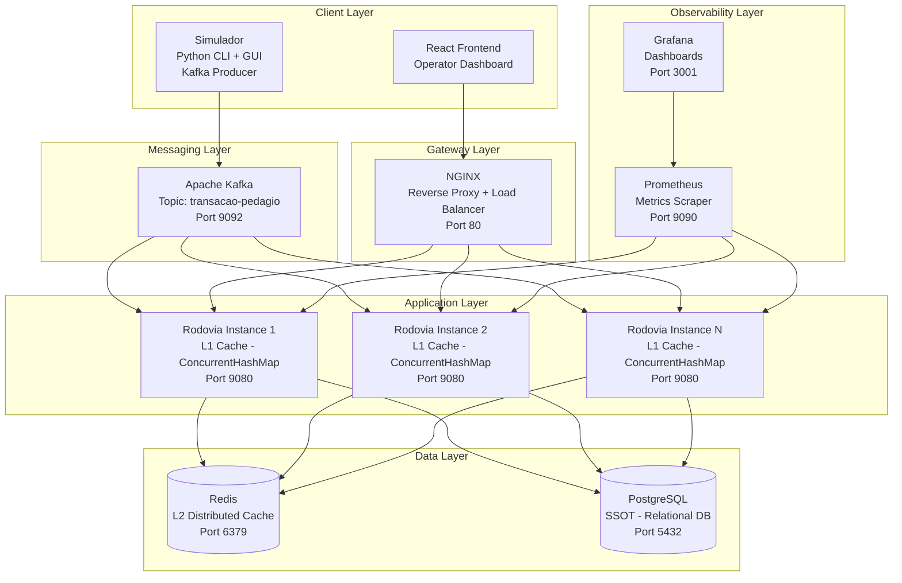
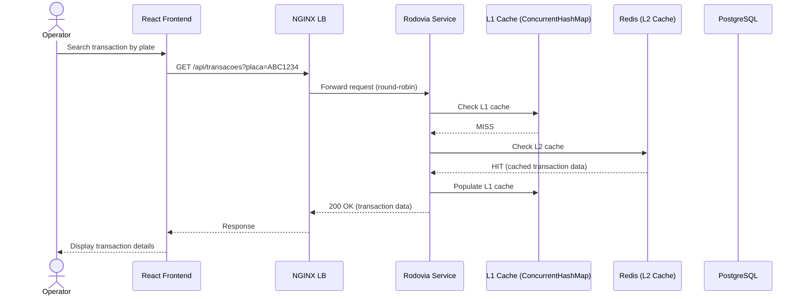
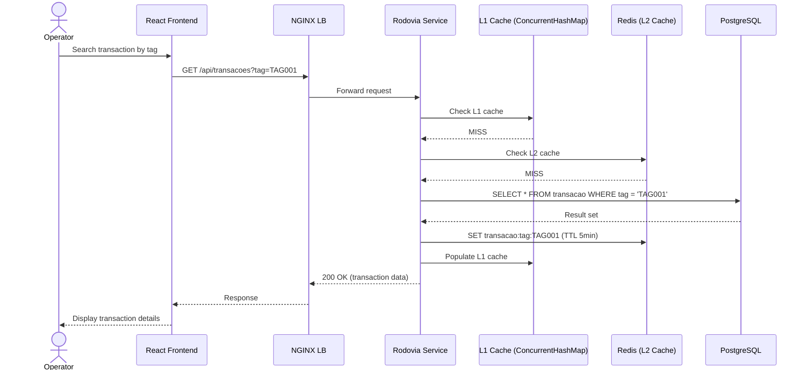
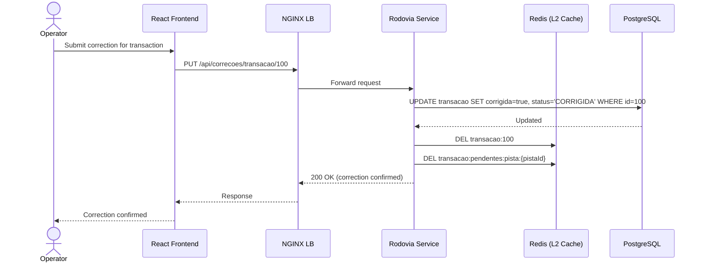
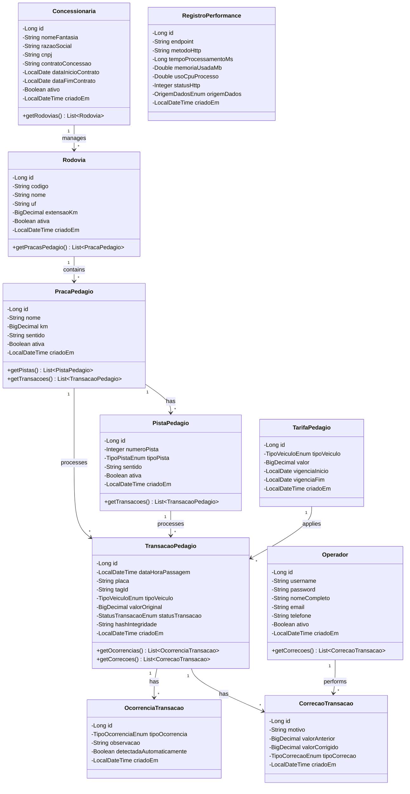
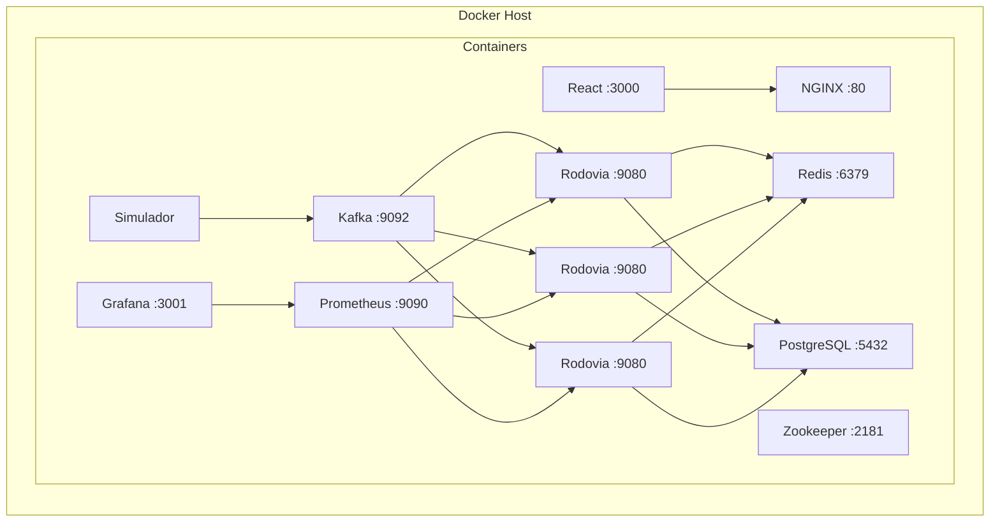
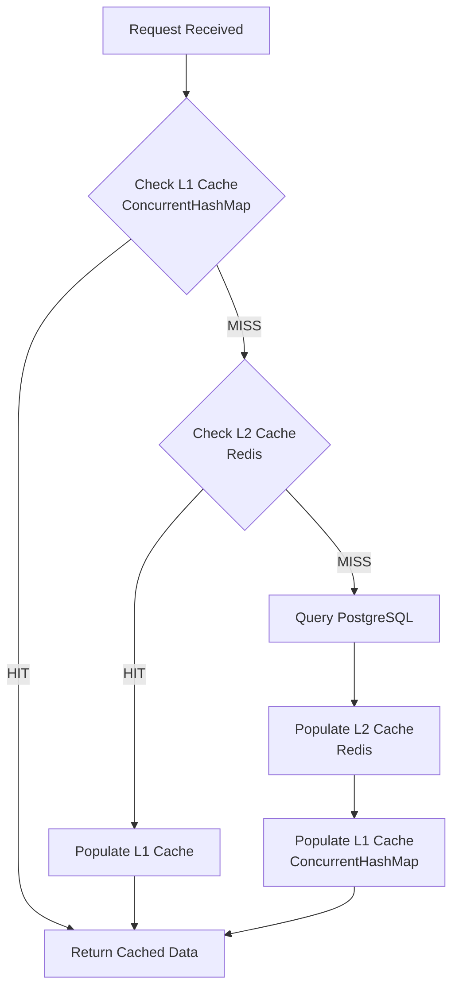

# UML Diagrams

All diagrams are rendered using [Mermaid](https://mermaid.js.org/) syntax.

---

## 1. Component Diagram

---

## 2. Sequence Diagram — Transaction Correction (Cache Hit on Redis)

---

## 3. Sequence Diagram — Transaction Correction (Cache Miss — Full Path)

---

## 4. Sequence Diagram — Transaction Correction Write

---

## 5. Class Diagram — Domain Model

---

## 6. Deployment Diagram

---

## 7. Activity Diagram — Cache Lookup Flow

